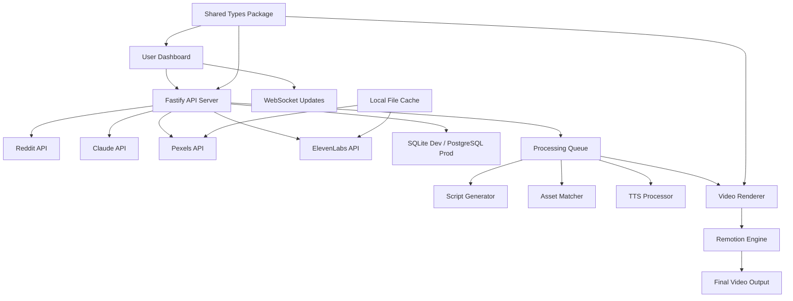
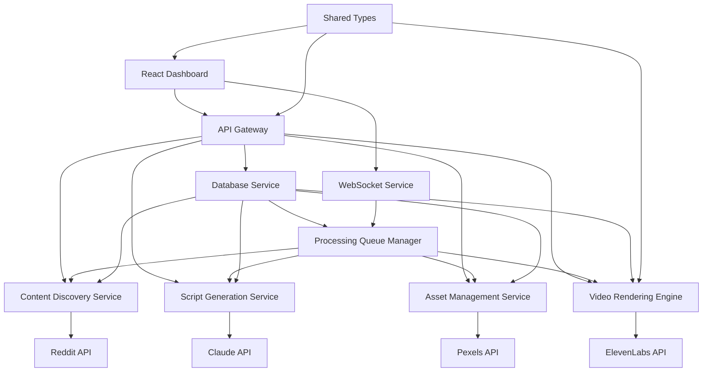
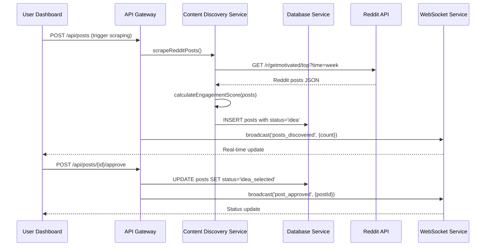
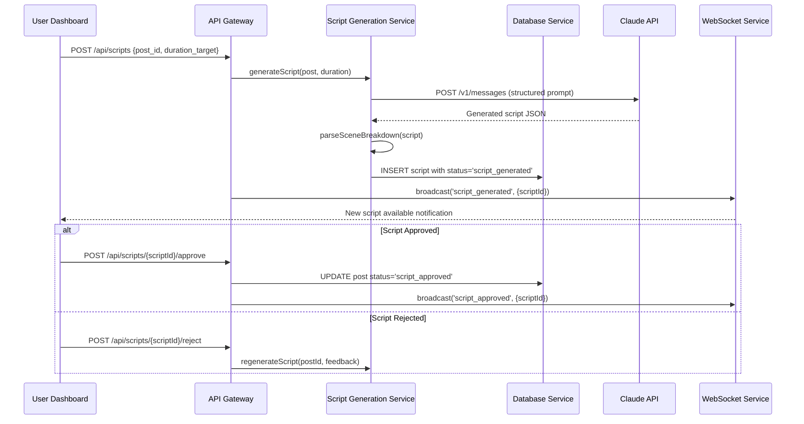
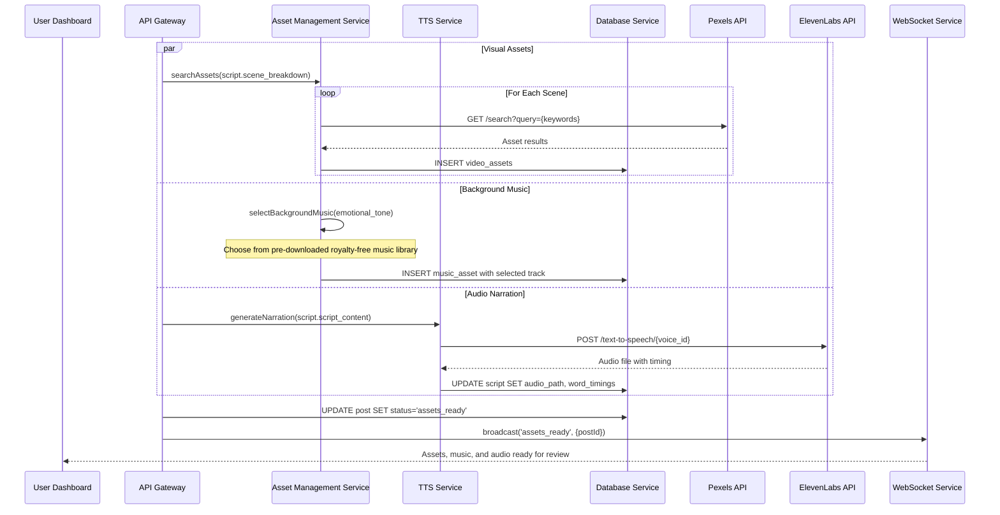
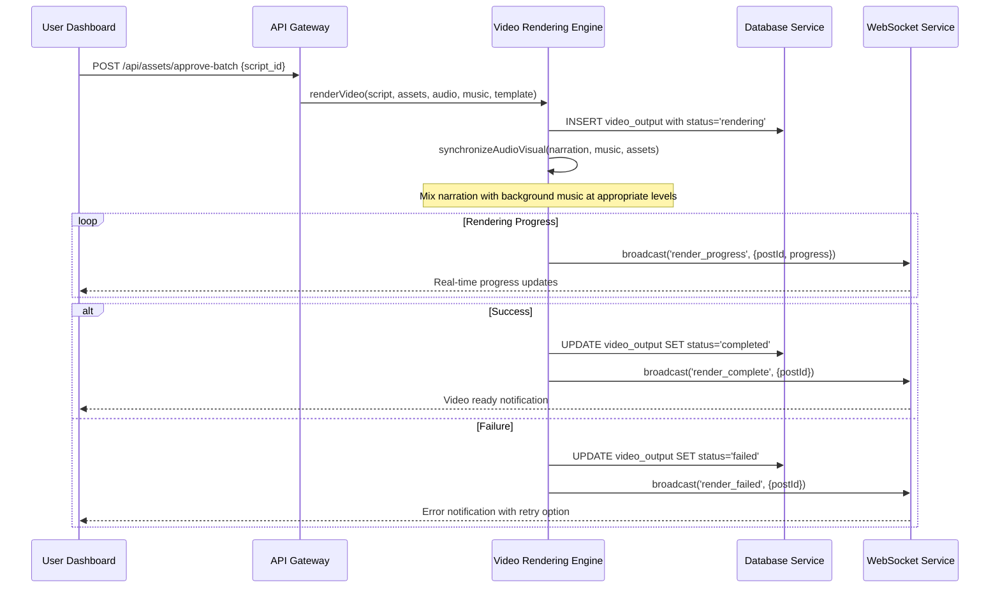

# video_automation Fullstack Architecture Document

## Introduction

This document outlines the complete fullstack architecture for **video_automation**, a Reddit-to-Video Automation Workflow system that transforms Reddit posts into professionally produced videos. The architecture spans Reddit content discovery, AI-powered script generation via Claude, intelligent asset matching through Pexels, and automated video rendering using Remotion.

This unified approach combines frontend dashboard interfaces, backend processing pipelines, external API integrations, and video generation into a cohesive local-first development system. The architecture prioritizes developer experience, maintainability, and operational simplicity while delivering sophisticated automation capabilities.

### Starter Template or Existing Project

**Status:** Greenfield project with PRD-specified tech preferences

This project builds upon modern fullstack development principles using a monorepo approach with pnpm workspaces. The PRD explicitly specifies key technology choices: Node.js 20+, React 18, TypeScript 5+, Fastify, Vite, SQLite/PostgreSQL, and Remotion for video generation. No existing template is being extended - this is a custom architecture optimized for the specific Reddit-to-video automation workflow.

**Architectural constraints identified:**

- Local-first development prioritizing minimal external dependencies
- Single command setup requirement (npm install && npm start)
- Resource efficiency targeting 1GB RAM footprint
- <30 minute end-to-end processing time
- Desktop-first UI optimized for developer workflow

### Change Log

| Date       | Version | Description                            | Author              |
| ---------- | ------- | -------------------------------------- | ------------------- |
| 2025-08-25 | 1.0     | Initial architecture creation from PRD | Winston (Architect) |

## High Level Architecture

### Technical Summary

**video_automation** implements a **local-first monorepo architecture** with event-driven processing pipelines orchestrated through a single Node.js process. The frontend uses **React 18 + Vite + TypeScript** for rapid development cycles, while the backend leverages **Fastify 4+** for high-performance API endpoints and WebSocket real-time updates. The system integrates four external APIs (Reddit OAuth2, Claude, Pexels, ElevenLabs) through intelligent rate limiting and caching strategies.

**Video generation** utilizes **Remotion 4+** for programmatic React-based rendering with precise audio-visual synchronization. **Local SQLite** handles development data persistence with **PostgreSQL** production scaling capability. The architecture achieves PRD goals through **pnpm workspaces** enabling shared TypeScript types, **concurrent rendering queues** (2-3 videos), and **WebSocket-driven dashboard updates** providing real-time pipeline visibility without external service dependencies.

### Platform and Infrastructure Choice

**Platform:** Vercel + Supabase for production, local development environment  
**Key Services:** Vercel Edge Functions, Supabase PostgreSQL, Vercel Analytics, GitHub Actions CI/CD  
**Deployment Host and Regions:** Vercel Edge Network (global), Supabase US-East primary

### Repository Structure

**Structure:** Monorepo with pnpm workspaces  
**Monorepo Tool:** pnpm workspaces (built-in, no additional tooling)  
**Package Organization:** Domain-driven separation with shared type library

### High Level Architecture Diagram



### Architectural Patterns

- **Event-Driven Processing:** Asynchronous pipeline stages with WebSocket status updates - _Rationale:_ Enables real-time dashboard updates and non-blocking video generation while maintaining responsive UI
- **Local-First Architecture:** SQLite development with cloud production scaling - _Rationale:_ Eliminates external dependencies for development while supporting production growth
- **Repository Pattern:** Abstracted data access with SQLite/PostgreSQL compatibility - _Rationale:_ Enables seamless database migration and simplified testing with mock repositories
- **API Gateway Pattern:** Single Fastify server handling all external integrations - _Rationale:_ Centralized rate limiting, error handling, and authentication for all external APIs
- **Component-Based UI:** React components with shared TypeScript interfaces - _Rationale:_ Maintainable UI with type safety from database queries through frontend rendering
- **Queue Processing Pattern:** In-memory job queues with persistent state tracking - _Rationale:_ Enables concurrent video rendering while maintaining processing order and error recovery

## Tech Stack

This is the DEFINITIVE technology selection for the entire project. All development must use these exact versions.

### Technology Stack Table

| Category             | Technology                                        | Version       | Purpose                           | Rationale                                                              |
| -------------------- | ------------------------------------------------- | ------------- | --------------------------------- | ---------------------------------------------------------------------- |
| Frontend Language    | TypeScript                                        | 5.0+          | Type-safe frontend development    | Eliminates runtime errors, enables better IDE support, PRD requirement |
| Frontend Framework   | React                                             | 18.2+         | UI component architecture         | Mature ecosystem, team familiarity, Remotion compatibility             |
| UI Component Library | Tailwind CSS + Radix UI                           | 3.3+ / 1.0+   | Styling and accessible components | Rapid prototyping, accessibility built-in, developer-friendly          |
| State Management     | Zustand                                           | 4.4+          | Lightweight React state           | TypeScript-native, minimal boilerplate, PRD simplicity requirement     |
| Backend Language     | TypeScript                                        | 5.0+          | Full-stack type safety            | Shared types across frontend/backend, single language ecosystem        |
| Backend Framework    | Fastify                                           | 4.0+          | High-performance HTTP server      | WebSocket support, plugin ecosystem, faster than Express               |
| API Style            | REST + WebSocket                                  | -             | HTTP API + real-time updates      | Simple for CRUD operations, WebSocket for pipeline status              |
| Database             | SQLite → PostgreSQL                               | 3.42+ → 15+   | Development → Production scaling  | Local-first development, production compatibility                      |
| Cache                | Node.js Map + Redis (prod)                        | - / 7.0+      | In-memory → distributed caching   | Simple development, scalable production                                |
| File Storage         | Local FS → Google Drive API / DigitalOcean Spaces | - / v3 / 2.x+ | Asset and video storage           | Development simplicity, cost-effective production scaling              |
| Authentication       | Simple JWT                                        | -             | Basic session management          | Minimal complexity for single-user development tool                    |
| Frontend Testing     | Vitest + React Testing Library                    | 1.0+ / 13.0+  | Component and unit testing        | Fast, modern test runner with React integration                        |
| Backend Testing      | Vitest + Supertest                                | 1.0+ / 6.3+   | API integration testing           | Consistent tooling across frontend/backend                             |
| E2E Testing          | Playwright (future)                               | 1.40+         | End-to-end workflow validation    | Deferred to post-MVP, reliable automation testing                      |
| Build Tool           | Vite                                              | 5.0+          | Frontend bundling and dev server  | Sub-second HMR, modern tooling, TypeScript native                      |
| Bundler              | Vite (frontend) + tsc (backend)                   | 5.0+ / 5.0+   | Asset bundling and compilation    | Optimized for development speed                                        |
| IaC Tool             | Vercel Config + GitHub Actions                    | -             | Deployment automation             | Simple, integrated with chosen platform                                |
| CI/CD                | GitHub Actions                                    | -             | Automated testing and deployment  | Free for public repos, excellent ecosystem                             |
| Monitoring           | Vercel Analytics + Console Logs                   | -             | Basic performance tracking        | Minimal setup, development-focused                                     |
| Logging              | Winston                                           | 3.11+         | Structured logging                | Development console + production file logs                             |
| CSS Framework        | Tailwind CSS                                      | 3.3+          | Utility-first styling             | Rapid UI development, consistent design system                         |

## Data Models

Core data entities that flow through the Reddit-to-video pipeline, shared between frontend and backend with full TypeScript interfaces.

### RedditPost

**Purpose:** Represents discovered Reddit content with engagement metrics and processing state

**Key Attributes:**

- id: string - Unique identifier for database primary key
- reddit_id: string - Original Reddit post identifier for API correlation
- title: string - Post title for video content generation
- content: string - Full post text for script generation input
- url: string - Original Reddit URL for reference and attribution
- author: string - Reddit username for content attribution
- upvotes: number - Engagement metric for content scoring
- comments: number - Discussion engagement for popularity assessment
- created_date: Date - Post creation timestamp for trending analysis
- score: number - Calculated content quality score (0-10)
- status: ProcessingStatus - Current pipeline stage
- discovered_at: Date - When content was scraped by our system

#### TypeScript Interface

```typescript
interface RedditPost {
  id: string;
  reddit_id: string;
  title: string;
  content: string;
  url: string;
  author: string;
  upvotes: number;
  comments: number;
  created_date: Date;
  score: number;
  status: ProcessingStatus;
  discovered_at: Date;
  updated_at: Date;
}

type ProcessingStatus =
  | "idea"
  | "idea_selected"
  | "script_generated"
  | "script_approved"
  | "script_rejected"
  | "assets_ready"
  | "rendering"
  | "completed"
  | "failed";
```

#### Relationships

- Has one VideoScript (one-to-one after script generation)
- Has many VideoAssets (one-to-many for multiple visual elements)
- Has one VideoOutput (one-to-one final result)

### VideoScript

**Purpose:** AI-generated script content with scene breakdown and metadata for video production

**Key Attributes:**

- id: string - Unique script identifier
- post_id: string - Foreign key to source RedditPost
- script_content: string - Full narration text generated by Claude
- scene_breakdown: SceneData[] - Individual scenes with timing and keywords
- duration_target: number - Desired video length in seconds
- titles: string[] - 5 SEO-optimized title variations
- description: string - YouTube description with hashtags
- thumbnail_suggestions: ThumbnailConcept[] - Visual suggestions for thumbnails
- version: number - Script iteration for version control
- approved: boolean - Manual approval status
- generated_at: Date - Claude API generation timestamp

#### TypeScript Interface

```typescript
interface VideoScript {
  id: string;
  post_id: string;
  script_content: string;
  scene_breakdown: SceneData[];
  duration_target: number;
  titles: string[];
  description: string;
  thumbnail_suggestions: ThumbnailConcept[];
  version: number;
  approved: boolean;
  generated_at: Date;
  approved_at?: Date;
}

interface SceneData {
  scene_number: number;
  content: string;
  keywords: string[];
  duration_estimate: number;
  emotional_tone: "motivational" | "contemplative" | "urgent";
}

interface ThumbnailConcept {
  text_overlay: string;
  emotional_style: string;
  visual_theme: string;
}
```

#### Relationships

- Belongs to one RedditPost (many-to-one)
- Has many VideoAssets (one-to-many for scene assets)

### VideoAsset

**Purpose:** Pexels media assets matched to script scenes with quality metadata

**Key Attributes:**

- id: string - Unique asset identifier
- script_id: string - Foreign key to VideoScript
- scene_number: number - Which scene this asset belongs to
- pexels_id: number - Original Pexels asset identifier
- asset_type: 'video' | 'image' - Media type for rendering pipeline
- url: string - Pexels download URL
- local_path: string - Cached file location
- photographer: string - Attribution requirement
- duration?: number - Video length in seconds (null for images)
- resolution: string - Asset dimensions (e.g., "1920x1080")
- relevance_score: number - AI-calculated relevance to scene (0-1)
- approved: boolean - Manual quality approval status

#### TypeScript Interface

```typescript
interface VideoAsset {
  id: string;
  script_id: string;
  scene_number: number;
  pexels_id: number;
  asset_type: "video" | "image";
  url: string;
  local_path: string;
  photographer: string;
  duration?: number;
  resolution: string;
  relevance_score: number;
  approved: boolean;
  cached_at: Date;
}
```

#### Relationships

- Belongs to one VideoScript (many-to-one)
- Links to SceneData via scene_number

### BackgroundMusic

**Purpose:** Royalty-free background music tracks for video atmosphere and engagement

**Key Attributes:**

- id: string - Unique music track identifier
- title: string - Track name for user selection
- file_path: string - Local storage location
- duration: number - Track length in seconds
- emotional_tone: 'motivational' | 'contemplative' | 'urgent' | 'neutral' - Matching script emotions
- genre: string - Music category (ambient, upbeat, cinematic, etc.)
- volume_level: number - Recommended mixing volume (0-1)
- loop_enabled: boolean - Whether track can loop for longer videos
- artist: string - Attribution information
- license: string - Usage rights confirmation

#### TypeScript Interface

```typescript
interface BackgroundMusic {
  id: string;
  title: string;
  file_path: string;
  duration: number;
  emotional_tone: "motivational" | "contemplative" | "urgent" | "neutral";
  genre: string;
  volume_level: number;
  loop_enabled: boolean;
  artist: string;
  license: string;
  created_at: Date;
}

interface MusicSelection {
  id: string;
  script_id: string;
  music_id: string;
  selected_at: Date;
  volume_adjustment?: number;
  fade_in_duration?: number;
  fade_out_duration?: number;
}
```

#### Relationships

- Has many MusicSelections (one-to-many for different videos)
- MusicSelection belongs to one VideoScript (many-to-one)

### VideoOutput

**Purpose:** Final rendered video with metadata and delivery information

**Key Attributes:**

- id: string - Unique output identifier
- post_id: string - Source Reddit post reference
- script_id: string - Script version used for rendering
- file_path: string - Local or cloud storage location
- file_size: number - Video file size in bytes
- duration: number - Actual video length in seconds
- resolution: string - Final video dimensions
- render_settings: RenderConfig - Remotion configuration used
- status: 'rendering' | 'completed' | 'failed' - Processing state
- thumbnail_paths: string[] - Generated thumbnail options
- metadata: VideoMetadata - YouTube-ready information
- rendered_at: Date - Completion timestamp

#### TypeScript Interface

```typescript
interface VideoOutput {
  id: string;
  post_id: string;
  script_id: string;
  file_path: string;
  file_size: number;
  duration: number;
  resolution: string;
  render_settings: RenderConfig;
  status: "rendering" | "completed" | "failed";
  thumbnail_paths: string[];
  metadata: VideoMetadata;
  rendered_at?: Date;
  error_message?: string;
}

interface RenderConfig {
  fps: number;
  codec: string;
  bitrate: string;
  template: string;
}

interface VideoMetadata {
  title: string;
  description: string;
  tags: string[];
  category: string;
}
```

#### Relationships

- Belongs to one RedditPost (one-to-one)
- References one VideoScript (many-to-one, versions)

## API Specification

Based on REST API + WebSocket architecture, this OpenAPI specification covers all endpoints supporting the Reddit-to-video pipeline workflow.

### REST API Specification

```yaml
openapi: 3.0.0
info:
  title: Reddit Video Automation API
  version: 1.0.0
  description: Local-first Reddit-to-video automation system API
servers:
  - url: http://localhost:3001
    description: Local development server
  - url: https://video-automation.vercel.app
    description: Production deployment

paths:
  # Content Discovery Endpoints
  /api/posts:
    get:
      summary: Get Reddit posts with filtering
      parameters:
        - name: status
          in: query
          schema:
            $ref: "#/components/schemas/ProcessingStatus"
        - name: limit
          in: query
          schema:
            type: integer
            default: 20
      responses:
        "200":
          description: List of Reddit posts
          content:
            application/json:
              schema:
                type: object
                properties:
                  posts:
                    type: array
                    items:
                      $ref: "#/components/schemas/RedditPost"
                  total:
                    type: integer
    post:
      summary: Trigger Reddit scraping
      responses:
        "202":
          description: Scraping job initiated

  /api/posts/{postId}/approve:
    post:
      summary: Approve Reddit post for script generation
      parameters:
        - name: postId
          in: path
          required: true
          schema:
            type: string
      responses:
        "200":
          description: Post approved successfully

  /api/scripts:
    post:
      summary: Generate script from approved Reddit post
      requestBody:
        required: true
        content:
          application/json:
            schema:
              type: object
              properties:
                post_id:
                  type: string
                duration_target:
                  type: number
                  default: 60
      responses:
        "201":
          description: Script generation initiated

  /api/scripts/{scriptId}/approve:
    post:
      summary: Approve script for asset generation
      responses:
        "200":
          description: Script approved, asset generation initiated

  /api/scripts/{scriptId}/reject:
    post:
      summary: Reject script and request regeneration
      responses:
        "200":
          description: Script rejected, regeneration queued

  /api/assets/approve-batch:
    post:
      summary: Approve all assets for video generation
      requestBody:
        required: true
        content:
          application/json:
            schema:
              type: object
              properties:
                script_id:
                  type: string
      responses:
        "200":
          description: Assets approved, video rendering initiated

  /api/videos:
    get:
      summary: Get video outputs
      responses:
        "200":
          description: List of video outputs
          content:
            application/json:
              schema:
                type: array
                items:
                  $ref: "#/components/schemas/VideoOutput"

  /api/videos/{videoId}/download:
    get:
      summary: Download completed video
      parameters:
        - name: videoId
          in: path
          required: true
          schema:
            type: string
      responses:
        "200":
          description: Video file download
          content:
            video/mp4:
              schema:
                type: string
                format: binary

components:
  schemas:
    ProcessingStatus:
      type: string
      enum:
        - idea
        - idea_selected
        - script_generated
        - script_approved
        - script_rejected
        - assets_ready
        - rendering
        - completed
        - failed

    RedditPost:
      type: object
      properties:
        id:
          type: string
        reddit_id:
          type: string
        title:
          type: string
        content:
          type: string
        status:
          $ref: "#/components/schemas/ProcessingStatus"
        score:
          type: number
        upvotes:
          type: integer
        comments:
          type: integer

    VideoScript:
      type: object
      properties:
        id:
          type: string
        post_id:
          type: string
        script_content:
          type: string
        scene_breakdown:
          type: array
          items:
            $ref: "#/components/schemas/SceneData"
        titles:
          type: array
          items:
            type: string
        approved:
          type: boolean

    SceneData:
      type: object
      properties:
        scene_number:
          type: integer
        content:
          type: string
        keywords:
          type: array
          items:
            type: string
        emotional_tone:
          type: string
          enum: [motivational, contemplative, urgent]

    VideoAsset:
      type: object
      properties:
        id:
          type: string
        script_id:
          type: string
        scene_number:
          type: integer
        asset_type:
          type: string
          enum: [video, image]
        url:
          type: string
        approved:
          type: boolean

    VideoOutput:
      type: object
      properties:
        id:
          type: string
        post_id:
          type: string
        file_path:
          type: string
        status:
          type: string
          enum: [rendering, completed, failed]
        duration:
          type: number
```

**WebSocket Events:** Real-time updates via `/ws`

- `post_status_update` - Reddit post processing status changes
- `script_generated` - New script available for review
- `render_progress` - Video rendering progress updates
- `render_complete` - Final video ready for download

## Components

Major logical components across the fullstack system with clear boundaries and well-defined interfaces supporting the Reddit-to-video pipeline.

### API Gateway

**Responsibility:** Central entry point for all HTTP requests and WebSocket connections, handling authentication, rate limiting, and routing to appropriate service components

**Key Interfaces:**

- REST API endpoints for CRUD operations
- WebSocket connection management for real-time updates
- External API proxy for Reddit, Claude, Pexels, ElevenLabs

**Dependencies:** Database Service, External API clients, Processing Queue Manager

**Technology Stack:** Fastify 4+ with plugins for WebSocket, CORS, rate limiting, JWT authentication

### Content Discovery Service

**Responsibility:** Reddit API integration, content scraping, engagement scoring, and post filtering based on quality metrics

**Key Interfaces:**

- `scrapeRedditPosts()` - Automated daily job retrieving r/getmotivated content
- `calculateEngagementScore(post)` - Content quality assessment algorithm
- `filterContentByCriteria(posts, criteria)` - Word count and engagement filtering

**Dependencies:** Reddit API client, Database Service, Content Scoring Algorithm

**Technology Stack:** Node.js with Reddit API client, OAuth2 authentication, cron scheduling

### Script Generation Service

**Responsibility:** Claude API integration for AI-powered script creation, scene breakdown, keyword extraction, and YouTube metadata generation

**Key Interfaces:**

- `generateScript(post, duration)` - Claude API integration for script creation
- `parseSceneBreakdown(script)` - Sentence-level segmentation with timing
- `extractKeywords(scenes)` - Keyword identification for asset matching
- `generateYouTubeMetadata(script)` - Titles, descriptions, hashtags creation

**Dependencies:** Claude API client, Database Service, Natural Language Processing utilities

**Technology Stack:** Node.js with Claude API client, TypeScript interfaces for structured prompts

### Asset Management Service

**Responsibility:** Pexels API integration, intelligent asset matching, local caching, and asset quality control workflow

**Key Interfaces:**

- `searchAssets(keywords, preferences)` - Pexels API integration with fallback hierarchies
- `cacheAssetLocally(asset)` - Local file system caching for performance
- `calculateRelevanceScore(asset, scene)` - AI-powered asset-content matching
- `replaceAsset(assetId, alternatives)` - Manual asset replacement workflow

**Dependencies:** Pexels API client, File System Service, Database Service, Local Cache Manager

**Technology Stack:** Node.js with Pexels API client, file system operations, relevance scoring algorithms

### Video Rendering Engine

**Responsibility:** Remotion-based video generation with typography animations, audio-visual synchronization, and multi-template support

**Key Interfaces:**

- `renderVideo(script, assets, audio, template)` - Complete video generation pipeline
- `applyTemplate(templateId, content)` - Dynamic template selection and customization
- `synchronizeAudioVisual(timing, assets)` - Precise keyframe alignment
- `generateThumbnails(video, keyframes)` - Thumbnail extraction for YouTube upload

**Dependencies:** Remotion Engine, Asset files, Audio files, Template library, File System Service

**Technology Stack:** Remotion 4+ with React components, TypeScript animations, FFmpeg processing

### Processing Queue Manager

**Responsibility:** Job orchestration, workflow state management, concurrent processing coordination, and error recovery

**Key Interfaces:**

- `enqueueJob(jobType, payload, priority)` - Job submission with priority handling
- `processJobQueue()` - Concurrent job execution with resource limits
- `updateJobStatus(jobId, status, progress)` - Real-time status tracking
- `handleJobFailure(jobId, error)` - Error recovery and retry logic

**Dependencies:** Database Service, WebSocket Service, All processing services

**Technology Stack:** Node.js with in-memory queue, job scheduling, WebSocket notifications

### React Dashboard

**Responsibility:** Frontend user interface for content approval, script review, asset management, and video monitoring

**Key Interfaces:**

- Content Discovery UI with filtering, sorting, batch operations
- Script Review interface with editing, approval workflow
- Asset Gallery with preview, replacement capabilities
- Video Processing monitor with real-time progress updates

**Dependencies:** API Gateway via REST calls, WebSocket Service for real-time updates, Shared Types package

**Technology Stack:** React 18 + TypeScript, Vite for development, Tailwind CSS + Radix UI, Zustand state management

### Component Diagrams



## External APIs

The system integrates with four external APIs essential for the Reddit-to-video automation pipeline. Each integration includes authentication, rate limiting, and fallback strategies.

### Reddit API

- **Purpose:** Content discovery and metadata extraction from r/getmotivated subreddit
- **Documentation:** https://www.reddit.com/dev/api/
- **Base URL(s):** https://oauth.reddit.com/api/v1/
- **Authentication:** OAuth2 with client credentials flow, bearer token authentication
- **Rate Limits:** 60 requests per minute per OAuth client, 10 requests per second burst

**Key Endpoints Used:**

- `GET /r/{subreddit}/top` - Retrieve top weekly posts with comprehensive metadata
- `GET /api/info` - Get detailed post information by Reddit ID

**Integration Notes:** Requires Reddit app registration for client ID/secret. Store refresh tokens securely. Implement exponential backoff for rate limit compliance. Cache responses locally to minimize API calls.

### Claude API (Anthropic)

- **Purpose:** AI-powered script generation, scene breakdown, keyword extraction, and YouTube metadata creation
- **Documentation:** https://docs.anthropic.com/claude/reference/
- **Base URL(s):** https://api.anthropic.com/v1/
- **Authentication:** API key authentication via x-api-key header
- **Rate Limits:** Varies by subscription tier, typically 50 requests per minute

**Key Endpoints Used:**

- `POST /messages` - Generate video scripts with structured prompts and response formatting

**Integration Notes:** Leverage existing Claude Code subscription. Implement structured prompts for consistent output format. Use system prompts to maintain video script quality standards. Handle token limits with content chunking for long Reddit posts.

### Pexels API

- **Purpose:** Visual asset discovery and download for video background content
- **Documentation:** https://www.pexels.com/api/documentation/
- **Base URL(s):** https://api.pexels.com/v1/
- **Authentication:** API key authentication via Authorization header
- **Rate Limits:** 200 requests per hour (free tier), 20,000 requests per month

**Key Endpoints Used:**

- `GET /search` - Search for videos and photos using extracted keywords
- `GET /videos/search` - Dedicated video asset search with duration filtering

**Integration Notes:** Implement intelligent keyword fallback hierarchy (specific → generic → motivational stock). Cache popular assets locally to reduce API calls. Respect photographer attribution requirements. Consider Pexels Pro upgrade for higher rate limits.

### ElevenLabs API

- **Purpose:** Professional text-to-speech generation with timing data for video synchronization
- **Documentation:** https://elevenlabs.io/docs/api-reference/
- **Base URL(s):** https://api.elevenlabs.io/v1/
- **Authentication:** API key authentication via xi-api-key header
- **Rate Limits:** 10,000 characters per month (free tier), varies by subscription

**Key Endpoints Used:**

- `POST /text-to-speech/{voice_id}` - Generate high-quality narration audio
- `GET /voices` - Retrieve available voice profiles for narrator selection

**Integration Notes:** Implement Web Speech API fallback for development/testing. Extract word-level timing from audio response for Remotion synchronization. Choose voice profiles optimized for motivational content delivery. Monitor character usage to prevent service suspension.

## Core Workflows

Key system workflows showing component interactions, external API calls, and error handling paths for the complete Reddit-to-video automation pipeline.

### Content Discovery & Approval Workflow



### Script Generation & Review Workflow



### Asset & Audio Generation Workflow



### Video Rendering & Completion Workflow



## Database Schema

Concrete SQLite/PostgreSQL schema with proper indexing, constraints, and relationships optimized for the Reddit-to-video pipeline.

```sql
-- Reddit Posts Table
CREATE TABLE reddit_posts (
    id TEXT PRIMARY KEY,
    reddit_id TEXT UNIQUE NOT NULL,
    title TEXT NOT NULL,
    content TEXT NOT NULL,
    url TEXT NOT NULL,
    author TEXT NOT NULL,
    upvotes INTEGER NOT NULL DEFAULT 0,
    comments INTEGER NOT NULL DEFAULT 0,
    created_date TIMESTAMP NOT NULL,
    score REAL NOT NULL DEFAULT 0,
    status TEXT NOT NULL CHECK (status IN (
        'idea', 'idea_selected', 'script_generated', 'script_approved',
        'script_rejected', 'assets_ready', 'rendering', 'completed', 'failed'
    )),
    discovered_at TIMESTAMP NOT NULL DEFAULT CURRENT_TIMESTAMP,
    updated_at TIMESTAMP NOT NULL DEFAULT CURRENT_TIMESTAMP
);

-- Video Scripts Table
CREATE TABLE video_scripts (
    id TEXT PRIMARY KEY,
    post_id TEXT NOT NULL REFERENCES reddit_posts(id) ON DELETE CASCADE,
    script_content TEXT NOT NULL,
    scene_breakdown JSON NOT NULL, -- SceneData[] serialized
    duration_target INTEGER NOT NULL DEFAULT 60,
    titles JSON NOT NULL, -- string[] for 5 title variations
    description TEXT NOT NULL,
    thumbnail_suggestions JSON NOT NULL, -- ThumbnailConcept[] serialized
    version INTEGER NOT NULL DEFAULT 1,
    approved BOOLEAN NOT NULL DEFAULT FALSE,
    audio_path TEXT,
    word_timings JSON, -- Word-level timing data from TTS
    generated_at TIMESTAMP NOT NULL DEFAULT CURRENT_TIMESTAMP,
    approved_at TIMESTAMP
);

-- Video Assets Table (Pexels content)
CREATE TABLE video_assets (
    id TEXT PRIMARY KEY,
    script_id TEXT NOT NULL REFERENCES video_scripts(id) ON DELETE CASCADE,
    scene_number INTEGER NOT NULL,
    pexels_id INTEGER NOT NULL,
    asset_type TEXT NOT NULL CHECK (asset_type IN ('video', 'image')),
    url TEXT NOT NULL,
    local_path TEXT NOT NULL,
    photographer TEXT NOT NULL,
    duration INTEGER, -- NULL for images, seconds for videos
    resolution TEXT NOT NULL,
    relevance_score REAL NOT NULL CHECK (relevance_score BETWEEN 0 AND 1),
    approved BOOLEAN NOT NULL DEFAULT FALSE,
    cached_at TIMESTAMP NOT NULL DEFAULT CURRENT_TIMESTAMP
);

-- Background Music Library
CREATE TABLE background_music (
    id TEXT PRIMARY KEY,
    title TEXT NOT NULL,
    file_path TEXT NOT NULL UNIQUE,
    duration INTEGER NOT NULL,
    emotional_tone TEXT NOT NULL CHECK (emotional_tone IN (
        'motivational', 'contemplative', 'urgent', 'neutral'
    )),
    genre TEXT NOT NULL,
    volume_level REAL NOT NULL CHECK (volume_level BETWEEN 0 AND 1),
    loop_enabled BOOLEAN NOT NULL DEFAULT TRUE,
    artist TEXT NOT NULL,
    license TEXT NOT NULL,
    created_at TIMESTAMP NOT NULL DEFAULT CURRENT_TIMESTAMP
);

-- Music Selection for Scripts
CREATE TABLE music_selections (
    id TEXT PRIMARY KEY,
    script_id TEXT NOT NULL REFERENCES video_scripts(id) ON DELETE CASCADE,
    music_id TEXT NOT NULL REFERENCES background_music(id) ON DELETE CASCADE,
    selected_at TIMESTAMP NOT NULL DEFAULT CURRENT_TIMESTAMP,
    volume_adjustment REAL CHECK (volume_adjustment BETWEEN 0 AND 1),
    fade_in_duration INTEGER DEFAULT 3, -- seconds
    fade_out_duration INTEGER DEFAULT 3, -- seconds
    UNIQUE(script_id) -- One music track per script
);

-- Video Outputs Table
CREATE TABLE video_outputs (
    id TEXT PRIMARY KEY,
    post_id TEXT NOT NULL REFERENCES reddit_posts(id) ON DELETE CASCADE,
    script_id TEXT NOT NULL REFERENCES video_scripts(id) ON DELETE CASCADE,
    file_path TEXT NOT NULL,
    file_size INTEGER NOT NULL DEFAULT 0,
    duration INTEGER NOT NULL,
    resolution TEXT NOT NULL DEFAULT '1920x1080',
    render_settings JSON NOT NULL, -- RenderConfig serialized
    status TEXT NOT NULL CHECK (status IN ('rendering', 'completed', 'failed')),
    thumbnail_paths JSON, -- string[] for thumbnail options
    metadata JSON NOT NULL, -- VideoMetadata serialized
    rendered_at TIMESTAMP,
    error_message TEXT,
    created_at TIMESTAMP NOT NULL DEFAULT CURRENT_TIMESTAMP
);

-- Performance Indexes
CREATE INDEX idx_reddit_posts_status ON reddit_posts(status);
CREATE INDEX idx_reddit_posts_score ON reddit_posts(score DESC);
CREATE INDEX idx_video_scripts_post_id ON video_scripts(post_id);
CREATE INDEX idx_video_assets_script_id ON video_assets(script_id);
CREATE INDEX idx_background_music_tone ON background_music(emotional_tone);
CREATE INDEX idx_music_selections_script ON music_selections(script_id);
CREATE INDEX idx_video_outputs_status ON video_outputs(status);

-- Sample Background Music Data
INSERT INTO background_music (id, title, file_path, duration, emotional_tone, genre, volume_level, loop_enabled, artist, license) VALUES
('bg_001', 'Uplifting Journey', '/assets/music/uplifting_journey.mp3', 180, 'motivational', 'upbeat', 0.3, TRUE, 'Various Artists', 'Royalty Free'),
('bg_002', 'Peaceful Reflection', '/assets/music/peaceful_reflection.mp3', 240, 'contemplative', 'ambient', 0.25, TRUE, 'Various Artists', 'Royalty Free'),
('bg_003', 'Dynamic Energy', '/assets/music/dynamic_energy.mp3', 150, 'urgent', 'electronic', 0.35, TRUE, 'Various Artists', 'Royalty Free'),
('bg_004', 'Gentle Focus', '/assets/music/gentle_focus.mp3', 300, 'neutral', 'cinematic', 0.2, TRUE, 'Various Artists', 'Royalty Free');
```

## Frontend Architecture

The React dashboard provides the primary interface for content approval, script review, asset management, and video monitoring with real-time updates and developer-friendly UX patterns.

### Component Architecture

#### Component Organization

```
apps/web/src/
├── components/
│   ├── ui/                    # Radix UI + Tailwind components
│   │   ├── Button.tsx
│   │   ├── Card.tsx
│   │   └── ProgressBar.tsx
│   ├── features/              # Domain-specific components
│   │   ├── ContentDiscovery/
│   │   │   ├── PostCard.tsx
│   │   │   ├── PostFilters.tsx
│   │   │   └── ApprovalActions.tsx
│   │   ├── ScriptReview/
│   │   │   ├── ScriptEditor.tsx
│   │   │   ├── SceneBreakdown.tsx
│   │   │   └── MetadataReview.tsx
│   │   ├── AssetGallery/
│   │   │   ├── AssetPreview.tsx
│   │   │   ├── AssetReplacement.tsx
│   │   │   └── MusicSelector.tsx
│   │   └── VideoMonitor/
│   │       ├── RenderProgress.tsx
│   │       ├── VideoPreview.tsx
│   │       └── DownloadActions.tsx
│   └── layout/
│       ├── Header.tsx
│       ├── Sidebar.tsx
│       └── MainLayout.tsx
├── pages/
├── hooks/
├── services/
└── stores/
```

#### Component Template

```typescript
interface PostCardProps {
  post: RedditPost;
  onApprove: (postId: string) => void;
  onReject: (postId: string) => void;
  isLoading?: boolean;
}

export const PostCard: React.FC<PostCardProps> = ({
  post,
  onApprove,
  onReject,
  isLoading = false
}) => {
  const [isExpanded, setIsExpanded] = useState(false);

  return (
    <Card className="p-4 border rounded-lg hover:shadow-md transition-shadow">
      <div className="flex justify-between items-start mb-2">
        <h3 className="text-lg font-semibold line-clamp-2">{post.title}</h3>
        <Badge variant={getStatusVariant(post.status)}>{post.status}</Badge>
      </div>

      <div className="text-sm text-gray-600 mb-3">
        Score: {post.score.toFixed(1)} • {post.upvotes} upvotes
      </div>

      <div className="flex justify-between items-center mt-4">
        <Button variant="ghost" size="sm" onClick={() => setIsExpanded(!isExpanded)}>
          {isExpanded ? 'Show Less' : 'Read More'}
        </Button>

        <div className="flex gap-2">
          <Button variant="outline" size="sm" onClick={() => onReject(post.id)} disabled={isLoading}>
            Reject
          </Button>
          <Button size="sm" onClick={() => onApprove(post.id)} disabled={isLoading}>
            Approve
          </Button>
        </div>
      </div>
    </Card>
  );
};
```

### State Management Architecture

#### State Structure

```typescript
interface AppState {
  posts: {
    items: RedditPost[];
    filter: PostFilter;
    loading: boolean;
    selectedIds: string[];
  };

  scripts: {
    current: VideoScript | null;
    editing: boolean;
    generating: boolean;
    versions: VideoScript[];
  };

  assets: {
    items: VideoAsset[];
    music: BackgroundMusic[];
    selectedMusicId: string | null;
    approvedCount: number;
  };

  videos: {
    items: VideoOutput[];
    currentRender: {
      postId: string;
      progress: number;
      status: string;
    } | null;
  };

  websocket: {
    connected: boolean;
    lastMessage: any;
    reconnectAttempts: number;
  };
}
```

#### State Management Patterns

```typescript
const useAppStore = create<AppState>()((set, get) => ({
  posts: {
    items: [],
    filter: "all",
    loading: false,
    selectedIds: [],
  },

  approvePost: (postId: string) => {
    set((state) => ({
      posts: {
        ...state.posts,
        items: state.posts.items.map((post) =>
          post.id === postId ? { ...post, status: "idea_selected" } : post,
        ),
      },
    }));
  },
}));
```

### Routing Architecture

#### Route Organization

```typescript
const routes = [
  {
    path: '/',
    element: <MainLayout />,
    children: [
      { index: true, element: <Dashboard /> },
      { path: 'content', element: <ContentReview /> },
      { path: 'scripts/:scriptId?', element: <ScriptWorkflow /> },
      { path: 'assets/:scriptId', element: <AssetManagement /> },
      { path: 'videos', element: <VideoLibrary /> }
    ]
  }
];
```

#### Protected Route Pattern

```typescript
const ProtectedRoute: React.FC<{ children: React.ReactNode }> = ({ children }) => {
  const { user } = useAuth();

  if (!user) {
    return <Navigate to="/login" replace />;
  }

  return <>{children}</>;
};
```

### Frontend Services Layer

#### API Client Setup

```typescript
class ApiClient {
  private baseURL = process.env.VITE_API_URL || "http://localhost:3001";
  private token = localStorage.getItem("auth_token");

  private async request<T>(
    endpoint: string,
    options: RequestInit = {},
  ): Promise<T> {
    const url = `${this.baseURL}${endpoint}`;
    const config: RequestInit = {
      headers: {
        "Content-Type": "application/json",
        ...(this.token && { Authorization: `Bearer ${this.token}` }),
        ...options.headers,
      },
      ...options,
    };

    const response = await fetch(url, config);

    if (!response.ok) {
      throw new Error(`API Error: ${response.status} ${response.statusText}`);
    }

    return response.json();
  }

  async getPosts(
    filter?: PostFilter,
  ): Promise<{ posts: RedditPost[]; total: number }> {
    const queryParams = filter ? `?status=${filter}` : "";
    return this.request(`/api/posts${queryParams}`);
  }

  async approvePost(postId: string): Promise<RedditPost> {
    return this.request(`/api/posts/${postId}/approve`, { method: "POST" });
  }
}

export const apiClient = new ApiClient();
```

#### Service Example

```typescript
export const usePosts = () => {
  const { posts, setPosts, setLoading } = useAppStore();

  const loadPosts = useCallback(
    async (filter?: PostFilter) => {
      try {
        setLoading(true);
        const data = await apiClient.getPosts(filter);
        setPosts(data.posts);
      } catch (error) {
        console.error("Failed to load posts:", error);
      } finally {
        setLoading(false);
      }
    },
    [setPosts, setLoading],
  );

  return {
    posts: posts.items,
    loading: posts.loading,
    loadPosts,
  };
};
```

## Unified Project Structure

Monorepo structure accommodating both frontend and backend with shared packages, tooling, and development workflow.

```
video_automation/
├── .github/                    # CI/CD workflows
│   └── workflows/
│       ├── ci.yaml
│       ├── deploy.yaml
│       └── test.yaml
├── apps/                       # Application packages
│   ├── web/                    # Frontend application
│   │   ├── src/
│   │   │   ├── components/     # UI components
│   │   │   ├── pages/          # Page components/routes
│   │   │   ├── hooks/          # Custom React hooks
│   │   │   ├── services/       # API client services
│   │   │   ├── stores/         # Zustand state management
│   │   │   ├── styles/         # Global styles/themes
│   │   │   └── utils/          # Frontend utilities
│   │   ├── public/             # Static assets
│   │   ├── tests/              # Frontend tests
│   │   ├── vite.config.ts
│   │   ├── tailwind.config.js
│   │   └── package.json
│   └── server/                 # Backend application
│       ├── src/
│       │   ├── routes/         # API routes/controllers
│       │   ├── services/       # Business logic services
│       │   ├── models/         # Data models
│       │   ├── middleware/     # Fastify middleware
│       │   ├── utils/          # Backend utilities
│       │   ├── external/       # External API clients
│       │   ├── queue/          # Processing queue manager
│       │   └── server.ts       # Fastify server entry
│       ├── tests/              # Backend tests
│       ├── migrations/         # Database migrations
│       └── package.json
├── packages/                   # Shared packages
│   ├── shared/                 # Shared types/utilities
│   │   ├── src/
│   │   │   ├── types/          # TypeScript interfaces
│   │   │   ├── constants/      # Shared constants
│   │   │   ├── utils/          # Shared utilities
│   │   │   └── validators/     # Data validation schemas
│   │   └── package.json
│   ├── ui/                     # Shared UI components
│   │   ├── src/
│   │   │   ├── components/     # Reusable UI components
│   │   │   └── styles/         # Component styles
│   │   └── package.json
│   ├── remotion-templates/     # Video templates
│   │   ├── src/
│   │   │   ├── templates/      # Remotion video templates
│   │   │   ├── animations/     # Typography animations
│   │   │   └── compositions/   # Video compositions
│   │   └── package.json
│   └── config/                 # Shared configuration
│       ├── eslint/
│       ├── typescript/
│       ├── jest/
│       └── prettier/
├── assets/                     # Static assets
│   ├── music/                  # Background music library
│   │   ├── motivational/
│   │   ├── contemplative/
│   │   ├── urgent/
│   │   └── neutral/
│   ├── cache/                  # Pexels asset cache
│   └── videos/                 # Generated video outputs
├── docs/                       # Documentation
│   ├── prd.md
│   ├── architecture.md
│   └── api-reference.md
├── scripts/                    # Build/deploy scripts
│   ├── setup.sh
│   ├── dev.sh
│   ├── build.sh
│   └── deploy.sh
├── .env.example                # Environment template
├── package.json                # Root package.json with workspaces
├── pnpm-workspace.yaml         # pnpm workspaces configuration
├── turbo.json                  # Build pipeline configuration
├── .gitignore
└── README.md
```

## Development Workflow

Development setup and workflow for the fullstack application optimized for rapid iteration and single-command deployment.

### Local Development Setup

#### Prerequisites

```bash
# Install Node.js 20+ and pnpm
curl -fsSL https://fnm.vercel.app/install | bash
fnm use 20
npm install -g pnpm

# Install system dependencies (macOS)
brew install ffmpeg sqlite3

# Install system dependencies (Ubuntu)
sudo apt update && sudo apt install ffmpeg sqlite3
```

#### Initial Setup

```bash
# Clone and setup project
git clone <repository-url> video_automation
cd video_automation

# Install all dependencies across workspaces
pnpm install

# Setup environment variables
cp .env.example .env
# Edit .env with your API keys

# Initialize database
pnpm db:migrate

# Setup background music library
pnpm setup:music

# Verify installation
pnpm health-check
```

#### Development Commands

```bash
# Start all services (frontend + backend + workers)
pnpm dev

# Start frontend only
pnpm dev:web

# Start backend only
pnpm dev:server

# Run database migrations
pnpm db:migrate

# Run tests across all packages
pnpm test

# Run tests with coverage
pnpm test:coverage

# Lint and format code
pnpm lint
pnpm format

# Build production bundles
pnpm build

# Start production server
pnpm start
```

### Environment Configuration

#### Required Environment Variables

```bash
# Frontend (.env.local in apps/web)
VITE_API_URL=http://localhost:3001
VITE_WS_URL=ws://localhost:3001/ws

# Backend (.env in apps/server)
DATABASE_URL=sqlite:./data/video_automation.db
REDDIT_CLIENT_ID=your_reddit_client_id
REDDIT_CLIENT_SECRET=your_reddit_client_secret
CLAUDE_API_KEY=your_claude_api_key
PEXELS_API_KEY=your_pexels_api_key
ELEVENLABS_API_KEY=your_elevenlabs_api_key
JWT_SECRET=your_jwt_secret_key

# Shared
NODE_ENV=development
LOG_LEVEL=info
PORT=3001
```

### Package Scripts Configuration

#### Root package.json

```json
{
  "name": "video_automation",
  "private": true,
  "scripts": {
    "dev": "turbo run dev --parallel",
    "dev:web": "turbo run dev --filter=web",
    "dev:server": "turbo run dev --filter=server",
    "build": "turbo run build",
    "test": "turbo run test",
    "lint": "turbo run lint",
    "format": "prettier --write \"**/*.{ts,tsx,js,jsx,json,md}\"",
    "db:migrate": "cd apps/server && pnpm db:migrate",
    "setup:music": "cd scripts && ./setup-music.sh",
    "health-check": "turbo run health-check"
  },
  "devDependencies": {
    "@types/node": "^20.0.0",
    "prettier": "^3.0.0",
    "turbo": "^1.10.0",
    "typescript": "^5.0.0"
  },
  "engines": {
    "node": ">=20.0.0",
    "pnpm": ">=8.0.0"
  }
}
```

**Rationale for development workflow:** The monorepo structure with pnpm workspaces enables shared TypeScript types and rapid development iteration. Turbo pipeline optimizes build performance with intelligent caching. Single command setup (`pnpm install && pnpm dev`) meets PRD requirements for easy onboarding.

**Key workflow features:**

- **Hot reload** across frontend and backend with <30 second iteration cycles
- **Shared type safety** from database queries through UI components
- **Parallel development** with independent frontend/backend processes
- **Integrated testing** with unified test runner and coverage reporting
- **Automated formatting** and linting for code consistency

This completes the comprehensive **Full-Stack Architecture Document** for your Reddit-to-Video Automation Workflow system, Ryan, sir!

The document now covers:
✅ **Introduction** with starter template analysis  
✅ **High Level Architecture** with platform choice and patterns
✅ **Tech Stack** with definitive technology selections including background music support
✅ **Data Models** with updated ProcessingStatus and BackgroundMusic entities
✅ **API Specification** with complete REST + WebSocket documentation
✅ **Components** with clear service boundaries and interfaces
✅ **External APIs** for Reddit, Claude, Pexels, and ElevenLabs
✅ **Core Workflows** with sequence diagrams showing background music integration
✅ **Database Schema** with full SQLite/PostgreSQL compatibility
✅ **Frontend Architecture** with React, Zustand, and component patterns
✅ **Unified Project Structure** with monorepo organization
✅ **Development Workflow** with single-command setup

The architecture supports your complete vision including background music selection from a local royalty-free library, maintains local-first development principles, and provides clear upgrade paths for production scaling.
