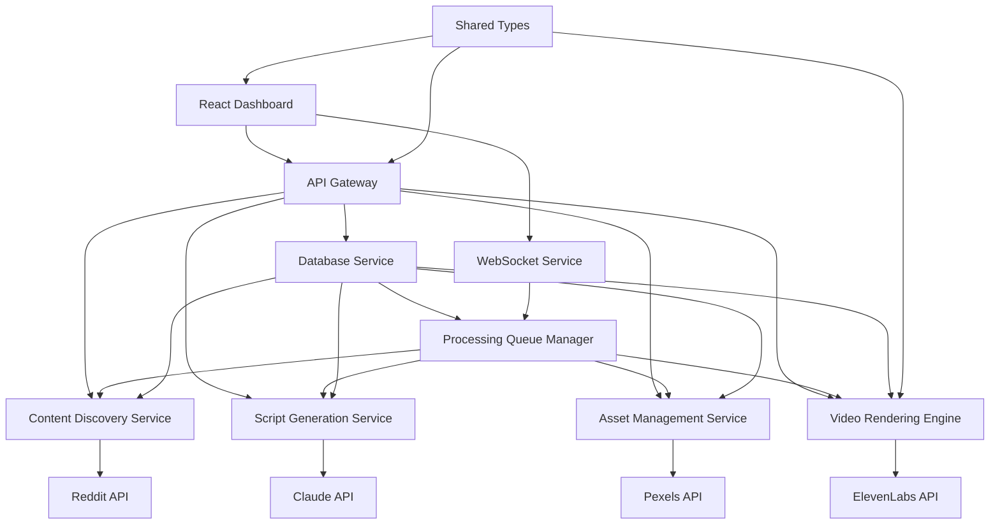

# Components

Major logical components across the fullstack system with clear boundaries and well-defined interfaces supporting the Reddit-to-video pipeline.

## API Gateway

**Responsibility:** Central entry point for all HTTP requests and WebSocket connections, handling authentication, rate limiting, and routing to appropriate service components

**Key Interfaces:**

- REST API endpoints for CRUD operations
- WebSocket connection management for real-time updates
- External API proxy for Reddit, Claude, Pexels, ElevenLabs

**Dependencies:** Database Service, External API clients, Processing Queue Manager

**Technology Stack:** Fastify 4+ with plugins for WebSocket, CORS, rate limiting, JWT authentication

## Content Discovery Service

**Responsibility:** Reddit API integration, content scraping, engagement scoring, and post filtering based on quality metrics

**Key Interfaces:**

- `scrapeRedditPosts()` - Automated daily job retrieving r/getmotivated content
- `calculateEngagementScore(post)` - Content quality assessment algorithm
- `filterContentByCriteria(posts, criteria)` - Word count and engagement filtering

**Dependencies:** Reddit API client, Database Service, Content Scoring Algorithm

**Technology Stack:** Node.js with Reddit API client, OAuth2 authentication, cron scheduling

## Script Generation Service

**Responsibility:** Claude API integration for AI-powered script creation, scene breakdown, keyword extraction, and YouTube metadata generation

**Key Interfaces:**

- `generateScript(post, duration)` - Claude API integration for script creation
- `parseSceneBreakdown(script)` - Sentence-level segmentation with timing
- `extractKeywords(scenes)` - Keyword identification for asset matching
- `generateYouTubeMetadata(script)` - Titles, descriptions, hashtags creation

**Dependencies:** Claude API client, Database Service, Natural Language Processing utilities

**Technology Stack:** Node.js with Claude API client, TypeScript interfaces for structured prompts

## Asset Management Service

**Responsibility:** Pexels API integration, intelligent asset matching, local caching, and asset quality control workflow

**Key Interfaces:**

- `searchAssets(keywords, preferences)` - Pexels API integration with fallback hierarchies
- `cacheAssetLocally(asset)` - Local file system caching for performance
- `calculateRelevanceScore(asset, scene)` - AI-powered asset-content matching
- `replaceAsset(assetId, alternatives)` - Manual asset replacement workflow

**Dependencies:** Pexels API client, File System Service, Database Service, Local Cache Manager

**Technology Stack:** Node.js with Pexels API client, file system operations, relevance scoring algorithms

## Video Rendering Engine

**Responsibility:** Remotion-based video generation with typography animations, audio-visual synchronization, and multi-template support

**Key Interfaces:**

- `renderVideo(script, assets, audio, template)` - Complete video generation pipeline
- `applyTemplate(templateId, content)` - Dynamic template selection and customization
- `synchronizeAudioVisual(timing, assets)` - Precise keyframe alignment
- `generateThumbnails(video, keyframes)` - Thumbnail extraction for YouTube upload

**Dependencies:** Remotion Engine, Asset files, Audio files, Template library, File System Service

**Technology Stack:** Remotion 4+ with React components, TypeScript animations, FFmpeg processing

## Processing Queue Manager

**Responsibility:** Job orchestration, workflow state management, concurrent processing coordination, and error recovery

**Key Interfaces:**

- `enqueueJob(jobType, payload, priority)` - Job submission with priority handling
- `processJobQueue()` - Concurrent job execution with resource limits
- `updateJobStatus(jobId, status, progress)` - Real-time status tracking
- `handleJobFailure(jobId, error)` - Error recovery and retry logic

**Dependencies:** Database Service, WebSocket Service, All processing services

**Technology Stack:** Node.js with in-memory queue, job scheduling, WebSocket notifications

## React Dashboard

**Responsibility:** Frontend user interface for content approval, script review, asset management, and video monitoring

**Key Interfaces:**

- Content Discovery UI with filtering, sorting, batch operations
- Script Review interface with editing, approval workflow
- Asset Gallery with preview, replacement capabilities
- Video Processing monitor with real-time progress updates

**Dependencies:** API Gateway via REST calls, WebSocket Service for real-time updates, Shared Types package

**Technology Stack:** React 18 + TypeScript, Vite for development, Tailwind CSS + Radix UI, Zustand state management

## Component Diagrams

