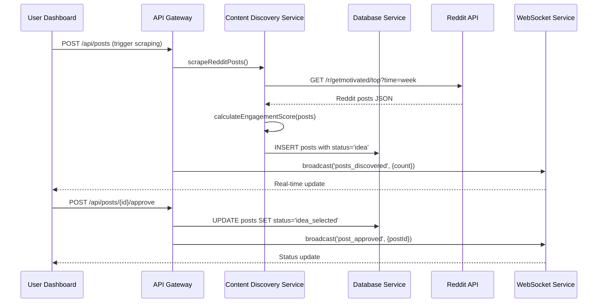
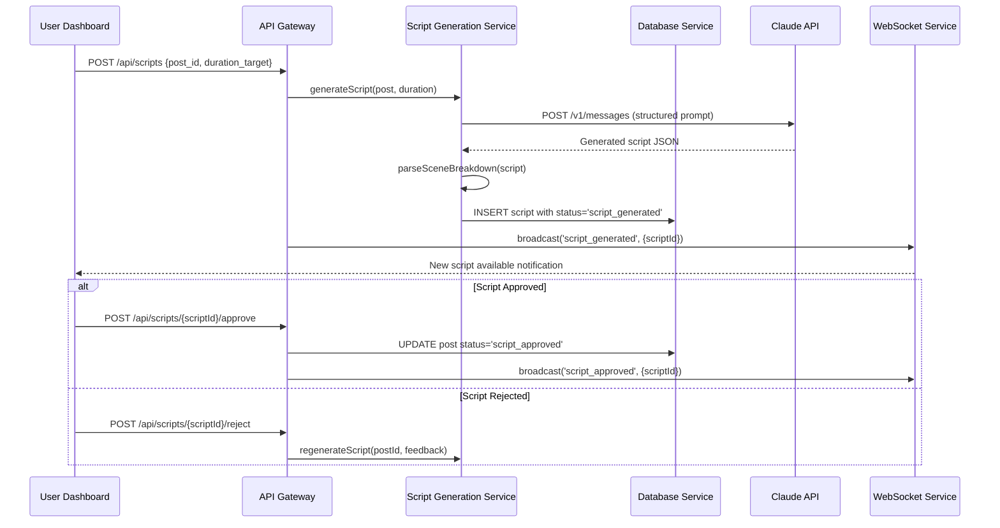
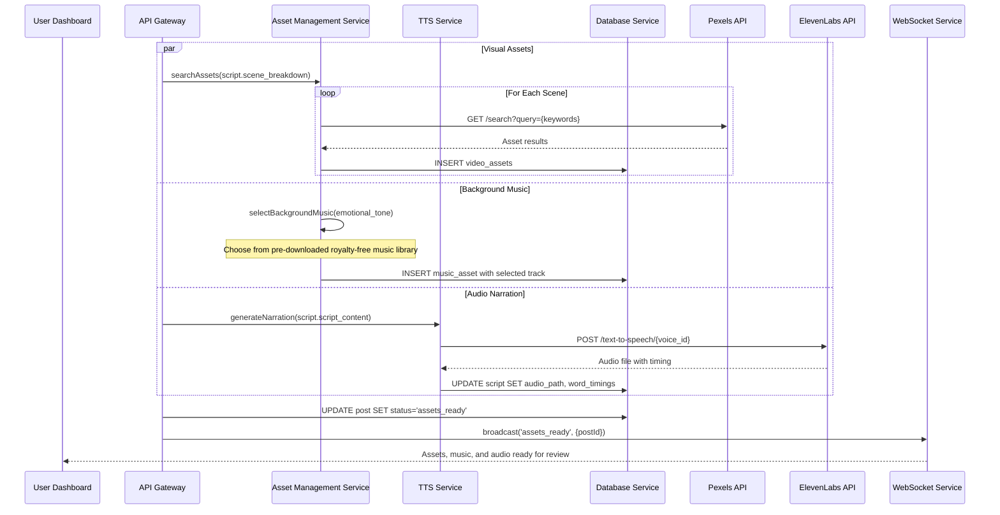
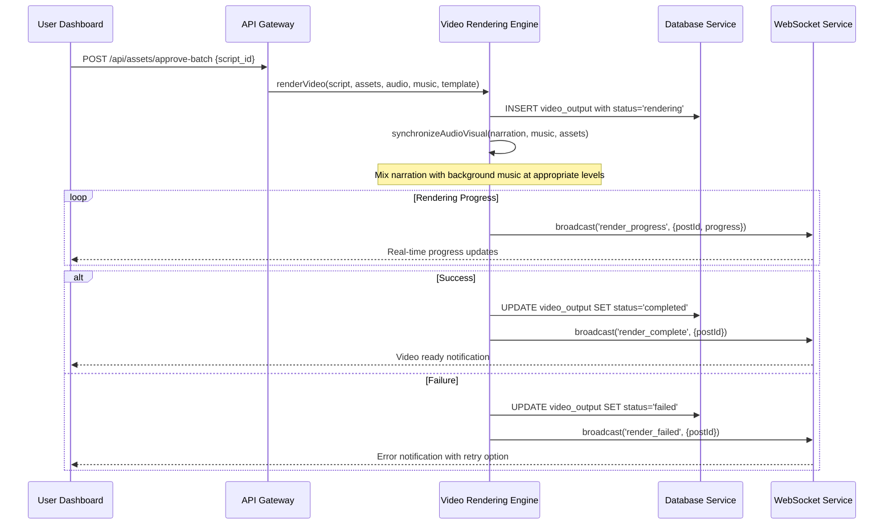

# Core Workflows

Key system workflows showing component interactions, external API calls, and error handling paths for the complete Reddit-to-video automation pipeline.

## Content Discovery & Approval Workflow

## Script Generation & Review Workflow

## Asset & Audio Generation Workflow

## Video Rendering & Completion Workflow

