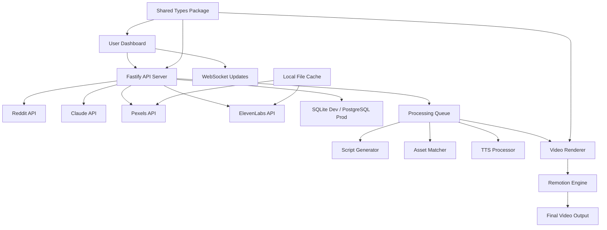

# High Level Architecture

## Technical Summary

**video_automation** implements a **local-first monorepo architecture** with event-driven processing pipelines orchestrated through a single Node.js process. The frontend uses **React 18 + Vite + TypeScript** for rapid development cycles, while the backend leverages **Fastify 4+** for high-performance API endpoints and WebSocket real-time updates. The system integrates four external APIs (Reddit OAuth2, Claude, Pexels, ElevenLabs) through intelligent rate limiting and caching strategies.

**Video generation** utilizes **Remotion 4+** for programmatic React-based rendering with precise audio-visual synchronization. **Local SQLite** handles development data persistence with **PostgreSQL** production scaling capability. The architecture achieves PRD goals through **pnpm workspaces** enabling shared TypeScript types, **concurrent rendering queues** (2-3 videos), and **WebSocket-driven dashboard updates** providing real-time pipeline visibility without external service dependencies.

## Platform and Infrastructure Choice

**Platform:** Vercel + Supabase for production, local development environment  
**Key Services:** Vercel Edge Functions, Supabase PostgreSQL, Vercel Analytics, GitHub Actions CI/CD  
**Deployment Host and Regions:** Vercel Edge Network (global), Supabase US-East primary

## Repository Structure

**Structure:** Monorepo with pnpm workspaces  
**Monorepo Tool:** pnpm workspaces (built-in, no additional tooling)  
**Package Organization:** Domain-driven separation with shared type library

## High Level Architecture Diagram

## Architectural Patterns

- **Event-Driven Processing:** Asynchronous pipeline stages with WebSocket status updates - _Rationale:_ Enables real-time dashboard updates and non-blocking video generation while maintaining responsive UI
- **Local-First Architecture:** SQLite development with cloud production scaling - _Rationale:_ Eliminates external dependencies for development while supporting production growth
- **Repository Pattern:** Abstracted data access with SQLite/PostgreSQL compatibility - _Rationale:_ Enables seamless database migration and simplified testing with mock repositories
- **API Gateway Pattern:** Single Fastify server handling all external integrations - _Rationale:_ Centralized rate limiting, error handling, and authentication for all external APIs
- **Component-Based UI:** React components with shared TypeScript interfaces - _Rationale:_ Maintainable UI with type safety from database queries through frontend rendering
- **Queue Processing Pattern:** In-memory job queues with persistent state tracking - _Rationale:_ Enables concurrent video rendering while maintaining processing order and error recovery
