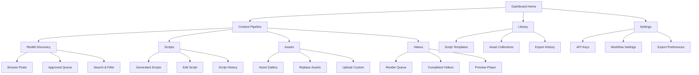
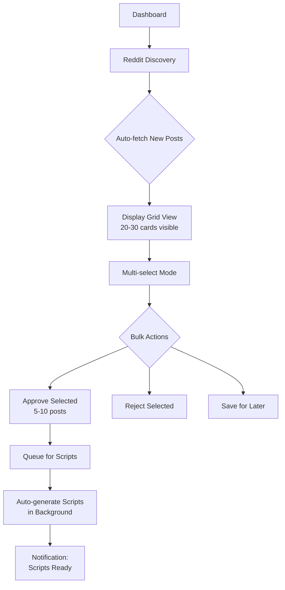
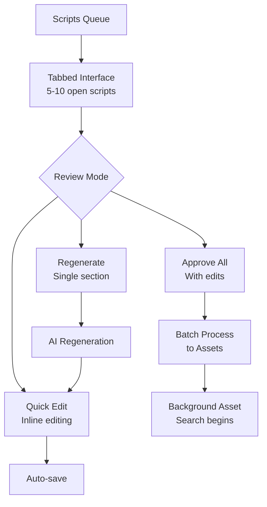
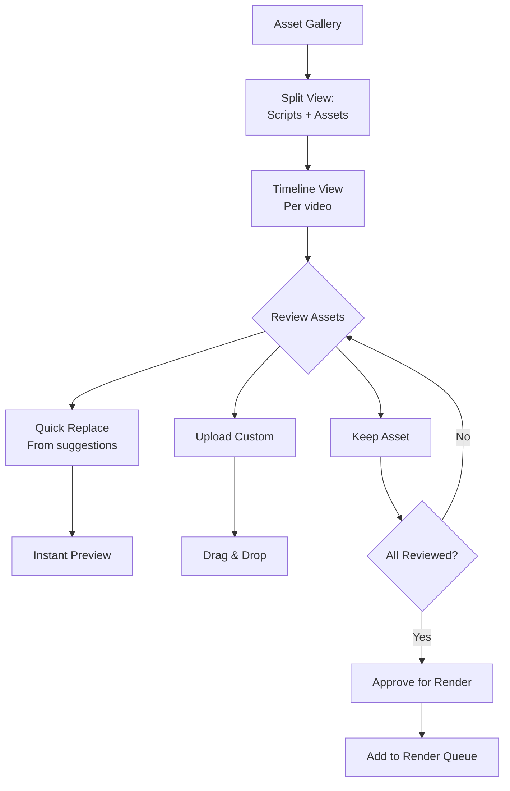
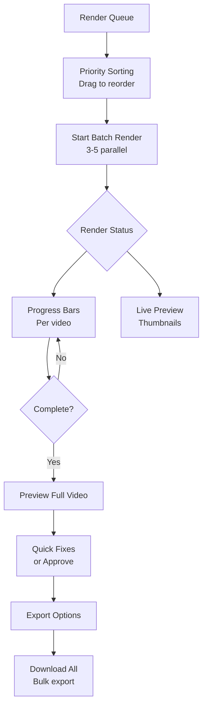

# Reddit Video Automation UI/UX Specification

## Introduction

This document defines the user experience goals, information architecture, user flows, and visual design specifications for Reddit Video Automation Workflow's user interface. It serves as the foundation for visual design and frontend development, ensuring a cohesive and user-centered experience.

### Overall UX Goals & Principles

#### Target User Personas

- **Content Manager:** Creative professional who wants intuitive content workflows, visual feedback, and clear approval processes without technical complexity
- **Solo Creator:** Independent content producer managing 3-5 videos/day, needs efficient batch operations and visual asset management
- **Quality Controller:** Focus on content review and curation, requires gallery views, preview capabilities, and easy asset replacement

#### Usability Goals

- **Visual Content Management:** Modern CMS experience with card-based layouts and visual previews
- **Intuitive Workflow:** Guide users through Reddit discovery → script → assets → video with clear visual steps
- **Quick Visual Review:** Approve/reject content through visual interfaces with thumbnail previews
- **Drag-and-Drop Simplicity:** Easy asset replacement and reordering without technical knowledge
- **One-Click Operations:** Single-click approvals, bulk actions, and status updates

#### Design Principles

1. **Modern CMS Experience** - Clean, visual interface like Webflow, Contentful, or Strapi
2. **Visual-First Design** - Card layouts, thumbnails, and preview-centric interfaces
3. **Guided Workflows** - Clear step-by-step process with visual progress indicators
4. **Touch-Friendly Controls** - Large click targets, visual buttons, minimal keyboard dependency
5. **Cloud-Native UI** - Web-based interface accessible from anywhere (local rendering happens server-side)

### Change Log

| Date       | Version | Description           | Author    |
| ---------- | ------- | --------------------- | --------- |
| 2025-08-27 | 1.0     | Initial specification | UX Expert |

## Information Architecture (IA)

### Site Map / Screen Inventory

### Navigation Structure

**Primary Navigation:** Horizontal top bar with main sections (Dashboard, Content Pipeline, Library, Settings) - always visible with active state indicators

**Secondary Navigation:** Left sidebar within each section showing subsections and current pipeline stage with visual progress indicators

**Breadcrumb Strategy:** Contextual breadcrumbs showing: Section > Subsection > Item (e.g., "Content Pipeline > Scripts > Edit: Top 5 Reddit Stories")

## User Flows

### Flow 1: High-Volume Reddit Discovery & Batch Approval

**User Goal:** Process 50-100 Reddit posts daily to generate 3-5 videos

**Entry Points:** Dashboard quick actions, Content Pipeline > Reddit Discovery, Daily digest email link

**Success Criteria:** Approve 5-10 posts in under 2 minutes with bulk operations

#### Flow Diagram

#### Edge Cases & Error Handling:

- Duplicate post detection with visual indicators
- Rate limit warnings with cooldown timer display
- Bulk approval limit (max 10 at once) to prevent overload
- Auto-save selections if connection drops

**Notes:** Grid view with compact cards essential for processing high volume quickly

### Flow 2: Parallel Script Review & Batch Processing

**User Goal:** Review and approve 5-10 generated scripts within 10 minutes

**Entry Points:** Script notification, Pipeline > Scripts, Keyboard shortcut (Ctrl+S)

**Success Criteria:** Review scripts with quick edit capabilities and batch approve

#### Flow Diagram

#### Edge Cases & Error Handling:

- Auto-save every 30 seconds during editing
- Conflict resolution for simultaneous edits
- Version history for rollback if needed
- Warning before bulk approval without review

### Flow 3: Efficient Asset Review Gallery

**User Goal:** Review and finalize assets for 3-5 videos in 15 minutes

**Entry Points:** Asset notification, Pipeline > Assets, Hotkey (Ctrl+A)

**Success Criteria:** Quick visual review with drag-drop replacement

#### Flow Diagram

#### Edge Cases & Error Handling:

- Fallback to generic assets if search fails
- Visual quality warnings for low-res assets
- Batch upload for custom asset libraries
- Auto-match assets to similar scripts

### Flow 4: Render Queue Management

**User Goal:** Process 3-5 videos through render pipeline efficiently

**Entry Points:** Videos section, Render notification, Dashboard widget

**Success Criteria:** Monitor and export multiple videos with minimal intervention

#### Flow Diagram

#### Edge Cases & Error Handling:

- Pause/resume capability for individual renders
- Error recovery with partial render resume
- Resource throttling for system stability
- Batch export with naming conventions

**Notes:** Parallel processing crucial for 3-5 videos/day throughput

## Wireframes & Mockups

**Primary Design Files:** Figma (recommended) - [To be created: reddit-video-automation-ui.fig]

### Key Screen Layouts

#### Dashboard Home

**Purpose:** Central command center showing pipeline status and quick actions for high-volume processing

**Key Elements:**

- Daily Stats Widget (Videos completed: 3/5, Scripts in queue: 8, Assets ready: 4)
- Pipeline Status Cards (Reddit: 45 new, Scripts: 8 pending, Assets: 4 ready, Render: 2 processing)
- Quick Actions Bar (Bulk Approve Reddit, Review Scripts, Start Batch Render)
- Recent Activity Feed (real-time updates on completions and errors)

**Interaction Notes:** Auto-refresh every 30 seconds, click any card to jump to that pipeline stage

**Design File Reference:** Frame: Dashboard-Home

#### Reddit Discovery Grid

**Purpose:** High-efficiency post review interface for processing 50-100 posts daily

**Key Elements:**

- Compact Card Grid (4-5 columns, 20-30 cards visible without scrolling)
- Each card: Thumbnail, title (truncated), score badge, subreddit tag, quick approve/reject buttons
- Top Action Bar: Select All, Filter dropdown, Bulk Approve button, Search box
- Left Filter Panel: Subreddit multi-select, score range slider, date picker

**Interaction Notes:** Shift+click for range selection, keyboard shortcuts (A=approve, R=reject, Space=toggle selection)

**Design File Reference:** Frame: Reddit-Discovery-Grid

#### Script Review Tabs

**Purpose:** Parallel script editing with efficient review workflow

**Key Elements:**

- Tab Bar (5-10 scripts open simultaneously, closeable tabs)
- Split View: Script editor (left 60%), Preview pane (right 40%)
- Inline Editing: Click any paragraph to edit, auto-save indicator
- Bottom Action Bar: Approve, Regenerate Section, Request Changes, Approve All Open

**Interaction Notes:** Ctrl+Tab to cycle scripts, auto-save every 30 seconds, highlight changed sections

**Design File Reference:** Frame: Script-Review-Tabs

#### Asset Gallery Timeline

**Purpose:** Visual asset management for multiple videos simultaneously

**Key Elements:**

- Video Selector Tabs (Video 1-5 with titles)
- Timeline View: Scene cards with asset thumbnails in sequence
- Right Panel: Alternative assets (4-6 suggestions per scene)
- Drag-drop zones for custom uploads

**Interaction Notes:** Drag assets between scenes, double-click for fullscreen preview

**Design File Reference:** Frame: Asset-Gallery-Timeline

#### Render Queue Monitor

**Purpose:** Manage parallel video rendering with clear status visibility

**Key Elements:**

- Queue List: Draggable cards for priority reordering
- Progress Bars: Individual progress per video with time remaining
- Preview Thumbnails: Live preview frames updating during render
- Batch Controls: Start All, Pause All, Clear Completed

**Interaction Notes:** Drag to reorder queue, click progress bar for detailed logs

**Design File Reference:** Frame: Render-Queue-Monitor

## Component Library / Design System

**Design System Approach:** Hybrid approach - Base on shadcn/ui components with custom extensions for video production workflows. This provides modern, accessible components while allowing customization for our specific high-volume content needs.

### Core Components

#### ContentCard

**Purpose:** Primary unit for displaying Reddit posts, scripts, and video previews across the pipeline

**Variants:** Compact (grid view), Expanded (detail view), Processing (with progress), Error state

**States:** Default, Hover (scale 1.02), Selected (border highlight), Processing (animated border), Disabled (opacity 0.5)

**Usage Guidelines:** Use Compact variant in grid layouts (Reddit discovery), Expanded for focused review, always include quick action buttons for approve/reject

#### BatchActionBar

**Purpose:** Persistent action bar for bulk operations across all pipeline stages

**Variants:** Top-fixed (main actions), Floating (contextual actions), Inline (within sections)

**States:** Default, Active (items selected), Processing (with progress), Success/Error feedback

**Usage Guidelines:** Always visible when items are selected, show count badge (e.g., "Approve 5"), include keyboard shortcut hints

#### PipelineProgress

**Purpose:** Visual indicator showing content progression through workflow stages

**Variants:** Horizontal steps (header), Vertical timeline (sidebar), Compact dots (cards)

**States:** Pending, Active (pulsing), Completed (checkmark), Error (red with icon), Skipped (gray)

**Usage Guidelines:** Use horizontal in main navigation, vertical in detail views, dots on individual cards

#### MediaPreview

**Purpose:** Display images and video thumbnails with playback controls

**Variants:** Thumbnail (16:9), Square (1:1 for gallery), Timeline (filmstrip view), Fullscreen modal

**States:** Loading (skeleton), Loaded, Playing (for video), Error (fallback image)

**Usage Guidelines:** Lazy load images, show duration badge for videos, include replace/edit actions on hover

#### QuickEditor

**Purpose:** Inline editing component for scripts and text content

**Variants:** Single-line (titles), Multi-line (paragraphs), Rich-text (with formatting)

**States:** Read-only, Editing (border highlight), Saving (spinner), Saved (checkmark flash)

**Usage Guidelines:** Click to edit pattern, auto-save after 2 seconds of inactivity, show character count for limits

#### TabGroup

**Purpose:** Manage multiple open items for parallel processing

**Variants:** Document tabs (scripts), Section tabs (pipeline stages), Overflow menu (5+ tabs)

**States:** Active, Inactive, Unsaved changes (dot indicator), Loading content

**Usage Guidelines:** Max 10 tabs visible, use overflow menu for more, include close button on hover

#### NotificationToast

**Purpose:** Real-time updates on background processes and completions

**Variants:** Success, Warning, Error, Progress (with bar), Action required

**States:** Entering (slide in), Displayed (auto-dismiss after 5s), Exiting (fade out)

**Usage Guidelines:** Stack in top-right corner, max 3 visible, critical errors don't auto-dismiss

## Branding & Style Guide

### Visual Identity

**Brand Guidelines:** Modern content creation platform with professional, efficient aesthetic

### Color Palette

| Color Type | Hex Code                  | Usage                                |
| ---------- | ------------------------- | ------------------------------------ |
| Primary    | #6366F1                   | Primary actions, active states, CTAs |
| Secondary  | #8B5CF6                   | Secondary buttons, accents           |
| Accent     | #EC4899                   | Notifications, highlights            |
| Success    | #10B981                   | Approved items, success states       |
| Warning    | #F59E0B                   | Processing, warnings                 |
| Error      | #EF4444                   | Errors, rejected items               |
| Neutral    | #1F2937, #6B7280, #F3F4F6 | Text, borders, backgrounds           |

### Typography

#### Font Families

- **Primary:** Inter (clean, modern sans-serif for UI)
- **Secondary:** Plus Jakarta Sans (headings, emphasis)
- **Monospace:** JetBrains Mono (scripts, code, timings)

#### Type Scale

| Element | Size | Weight | Line Height |
| ------- | ---- | ------ | ----------- |
| H1      | 32px | 700    | 1.2         |
| H2      | 24px | 600    | 1.3         |
| H3      | 20px | 600    | 1.4         |
| Body    | 14px | 400    | 1.5         |
| Small   | 12px | 400    | 1.4         |

### Iconography

**Icon Library:** Lucide Icons (consistent, modern line icons)

**Usage Guidelines:**

- 20px default size for UI icons
- 16px for compact/inline icons
- 24px for primary action buttons
- Maintain 2px stroke width
- Use duo-tone for selected/active states

### Spacing & Layout

**Grid System:** 8px base unit system

- Components align to 8px grid
- Spacing increments: 4, 8, 16, 24, 32, 48, 64px
- Container max-width: 1440px with 24px padding

**Spacing Scale:**

- xs: 4px (tight groups)
- sm: 8px (related items)
- md: 16px (sections)
- lg: 24px (major sections)
- xl: 48px (page sections)

## Accessibility Requirements

### Compliance Target

**Standard:** WCAG 2.1 AA compliance as minimum, with AAA considerations for critical workflows

### Key Requirements

**Visual:**

- Color contrast ratios: Minimum 4.5:1 for normal text, 3:1 for large text, 7:1 for critical actions (approve/reject)
- Focus indicators: 2px solid outline with 2px offset, high contrast color (#6366F1 on light, #93C5FD on dark)
- Text sizing: Base 14px minimum, user scalable to 200% without horizontal scroll

**Interaction:**

- Keyboard navigation: Full keyboard access to all features, Tab order follows visual hierarchy, Skip links for main content
- Screen reader support: Semantic HTML5, ARIA labels for icons, Live regions for status updates, Form field descriptions
- Touch targets: Minimum 44x44px for mobile, 32x32px for desktop with 8px spacing between targets

**Content:**

- Alternative text: Descriptive alt text for all Reddit post images, video thumbnail descriptions, status icon labels
- Heading structure: Logical H1-H6 hierarchy, One H1 per page, Section headings for navigation
- Form labels: Clear labels for all inputs, Helper text for complex fields, Error messages linked to fields

### Testing Strategy

**Automated Testing:**

- axe-core integration in development
- Pa11y CI pipeline checks
- Lighthouse accessibility audits

**Manual Testing:**

- Keyboard-only navigation testing
- Screen reader testing (NVDA, JAWS)
- Color blindness simulation
- Cognitive load assessment for high-volume workflows

**User Testing:**

- Include users with disabilities in testing
- Focus on efficiency for repetitive tasks
- Validate bulk operation accessibility

## Responsiveness Strategy

### Breakpoints

| Breakpoint | Min Width | Max Width | Target Devices               |
| ---------- | --------- | --------- | ---------------------------- |
| Mobile     | 320px     | 767px     | Phones (monitoring only)     |
| Tablet     | 768px     | 1023px    | iPads (basic review)         |
| Desktop    | 1024px    | 1919px    | Primary workstations         |
| Wide       | 1920px    | -         | Large monitors, multi-screen |

### Adaptation Patterns

**Layout Changes:**

- Desktop (1024px+): Full multi-column layouts, all panels visible, grid view 4-5 columns
- Tablet (768px-1023px): Collapsible sidebar, grid view 2-3 columns, stacked panels
- Mobile (320px-767px): Single column, bottom navigation, view-only mode (no editing)

**Navigation Changes:**

- Desktop: Persistent top nav + sidebar, breadcrumbs visible, command palette
- Tablet: Hamburger sidebar, simplified breadcrumbs, touch-optimized controls
- Mobile: Bottom tab bar, minimal navigation, swipe gestures for pipeline stages

**Content Priority:**

- Desktop: Show all information - previews, metadata, actions
- Tablet: Hide secondary metadata, larger touch targets, simplified actions
- Mobile: Essential info only - titles, status, view-only access

**Interaction Changes:**

- Desktop: Hover states, right-click menus, keyboard shortcuts, drag-and-drop
- Tablet: Touch-first interactions, long-press menus, simplified drag-and-drop
- Mobile: Tap only, no complex interactions, read-only with status monitoring

## Animation & Micro-interactions

### Motion Principles

- **Purpose-driven:** Every animation serves a functional purpose - feedback, state change, or guidance
- **Performance-first:** Prefer CSS transforms over JavaScript animations
- **Respect preferences:** Honor prefers-reduced-motion for accessibility
- **Consistent timing:** 200ms for micro-interactions, 300ms for page transitions

### Key Animations

- **Card Hover:** Scale(1.02) with box-shadow expansion (Duration: 200ms, Easing: ease-out)
- **Approval Animation:** Check icon scales in with success color fade (Duration: 300ms, Easing: cubic-bezier)
- **Progress Bars:** Smooth width transitions with pulse on completion (Duration: 500ms, Easing: linear)
- **Tab Switching:** Slide and fade between content panels (Duration: 250ms, Easing: ease-in-out)
- **Notification Slide:** Enter from right, exit fade up (Duration: 300ms, Easing: ease-out)

## Performance Considerations

### Performance Goals

- **Page Load:** Initial load under 2 seconds, interactive under 3 seconds
- **Interaction Response:** User actions respond within 100ms
- **Animation FPS:** Maintain 60fps for all animations

### Design Strategies

- Virtual scrolling for lists over 50 items
- Lazy load images with blur-up placeholders
- Progressive enhancement for complex features
- Optimistic UI updates for better perceived performance
- Debounced search and filter operations
- Skeleton screens during data loading

## Next Steps

### Immediate Actions

1. Review specification with stakeholders for alignment on high-volume workflow needs
2. Create Figma/design tool mockups based on these wireframes
3. Set up shadcn/ui component library with custom extensions
4. Implement virtual scrolling POC for Reddit grid view
5. Test bulk operation performance with 50+ items

### Design Handoff Checklist

- [x] All user flows documented
- [x] Component inventory complete
- [x] Accessibility requirements defined
- [x] Responsive strategy clear
- [x] Brand guidelines incorporated
- [x] Performance goals established

## Checklist Results

_UI/UX checklist validation pending_
