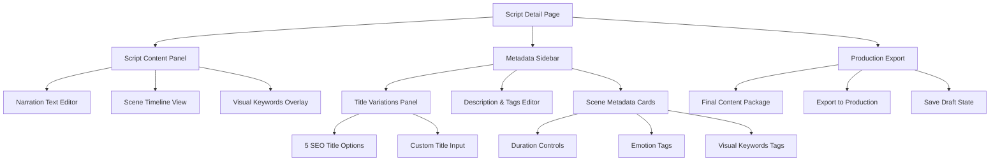
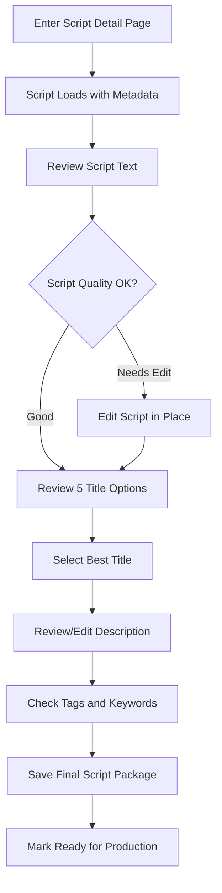
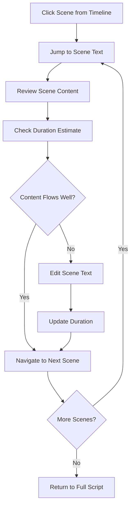

# Sprint 004: Enhanced Script Detail Page UI/UX Specification

## Sprint Overview

**Sprint Goal:** Transform the basic script display into a comprehensive content review interface that showcases all rich metadata generated by Claude Code integration.

**Related Documentation:**

- [Frontend Specification](/docs/front-end-spec.md)
- [PRD Epic 2: AI-Powered Script Generation](/docs/prd/epic-2-ai-powered-script-generation-review-pipeline.md)
- [Claude Code Integration](/apps/server/src/services/claude-code/scriptGenerator.ts)

## Problem Statement

**Current State:** The script detail page displays only basic script text content, despite Claude Code generating rich metadata including:

- 5 SEO-optimized title variations
- YouTube descriptions with hashtags
- Thumbnail concepts with text overlays
- Scene breakdowns with timing and visual keywords
- Emotion tags and content categorization

**Gap Identified:** There is a significant disconnect between the rich metadata Claude Code produces and the minimal frontend display, limiting content creators' ability to fully utilize AI-generated content packages.

## Sprint 004 UI/UX Specification

### Introduction

This specification defines the user experience transformation for the script detail page in Sprint 004, creating a comprehensive content review interface that bridges the gap between Claude Code's rich metadata generation and user-friendly content editing workflows.

### Overall UX Goals & Principles

#### Target User Personas

**Content Creator:** YouTube creators who need to review and refine AI-generated scripts before production. They want to see all metadata options (5 titles, descriptions, scene breakdowns) to make informed decisions about their content package.

**Video Producer:** Team members who need to coordinate production elements like scene timing and content flow. They require clear visualization of script segments with associated metadata for efficient workflow management.

**SEO Optimizer:** Users focused on maximizing video discoverability who need easy access to title variations, descriptions, tags, and optimization data.

#### Usability Goals

- **Quick Content Review:** Users can scan all generated content (script, titles, descriptions, scenes) within 30 seconds to assess quality
- **Efficient Editing:** Content creators can modify any element (titles, descriptions, scene timing) with immediate visual feedback
- **Seamless Export:** One-click export of final content package ready for video production and platform upload
- **Context Switching:** Users can toggle between script editing and metadata refinement without losing their place

#### Design Principles

1. **Content-First Hierarchy** - Script narration remains primary focus with metadata as contextual enhancement
2. **Progressive Disclosure** - Show essential elements first, reveal detailed options on demand
3. **Visual Metadata** - Transform text-based outputs into scannable, actionable content blocks
4. **Editing Confidence** - Every modification shows immediate preview with clear save/revert options
5. **Production Bridge** - Design connects content creation directly to video production workflow

### Information Architecture (IA)

#### Site Map / Screen Inventory



#### Navigation Structure

**Primary Navigation:** Split-pane layout with script content as the main focus (70% width) and collapsible metadata panel (30% width). Tab system within metadata panel for different content types (Titles, Descriptions, Scenes, Export).

**Secondary Navigation:** Scene timeline scrubber at bottom of script panel, allowing users to jump between script segments while seeing associated metadata. Breadcrumb showing: Dashboard > Scripts > [Reddit Post Title] > Script Detail

**Breadcrumb Strategy:** Contextual navigation showing the source Reddit post and current editing state, with quick access to return to script list or generate new variations.

### User Flows

#### Content Review and Selection Flow

**User Goal:** Review AI-generated content package and select optimal elements for video production

**Entry Points:** Script list page, direct link from generation queue, or dashboard script card

**Success Criteria:** User has reviewed all metadata options, made selections, and exported final content package ready for production

##### Flow Diagram



##### Edge Cases & Error Handling:

- Script text too long → Show character count warning
- No title selected → Highlight required selection before save
- Auto-save fails → Show retry with local storage backup

#### Scene Navigation Flow

**User Goal:** Navigate through script scenes to review timing and content flow

**Entry Points:** Scene timeline or keyboard navigation

**Success Criteria:** All scenes reviewed with appropriate pacing and content

##### Flow Diagram



##### Edge Cases & Error Handling:

- Scene too short/long → Duration guidance tooltip
- Navigation beyond script bounds → Loop to beginning/end
- Unsaved scene changes → Auto-save every 30 seconds

### Key Screen Layouts

#### Script Detail Page - Main Layout

**Purpose:** Comprehensive script review interface showcasing Claude Code's rich textual metadata in a clean, focused layout

**Key Elements:**

- Full-width script text editor with scene timeline scrubber
- Right sidebar with collapsible metadata panels (Titles, Description, Scene Info)
- Top navigation breadcrumb and action buttons (Save, Mark Ready)
- Scene navigation controls integrated with script text
- Status indicators for completion and edit state

**Interaction Notes:** Click any scene in timeline to jump to that section of script. Metadata sidebar can collapse to maximize script reading area. All text fields support inline editing with auto-save. Title selection uses radio buttons for single selection from 5 options.

#### Title Selection Panel

**Purpose:** Display and select from 5 AI-generated SEO-optimized title variations

**Key Elements:**

- 5 title options displayed as selectable cards with character count
- Selected title highlighted with primary color border
- "Custom Title" option with text input field
- SEO score indicators for each title option
- Copy-to-clipboard functionality for selected title

**Interaction Notes:** Single selection only - clicking new title deselects previous. Custom title field appears when "Add Custom" is clicked. Character count updates in real-time with color coding (green/yellow/red for optimal/acceptable/too long).

#### Script Scene Timeline

**Purpose:** Navigate through script scenes with visual timing and content indicators

**Key Elements:**

- Horizontal timeline showing scene segments proportional to duration
- Scene numbers and brief content preview on hover
- Current position indicator with smooth scroll animation
- Duration display for each scene segment
- Scene separator markers with edit handles

**Interaction Notes:** Click any scene to jump script view to that section. Drag scene separators to adjust scene boundaries. Timeline remains fixed at bottom during scroll. Scene preview appears on hover with fade-in animation.

### Component Library / Design System

**Design System Approach:** Extend existing shadcn/ui component library with custom script-focused components. Maintain consistency with current dashboard and workflow pages while adding specialized elements for script metadata display and editing.

#### Core Components

##### ScriptEditor Component

**Purpose:** Main script text editing interface with scene-aware functionality

**Variants:**

- Read-only view for review mode
- Edit mode with inline text editing
- Scene-highlighted mode showing current scene boundaries

**States:** Loading, editing, saving, saved, error, read-only

**Usage Guidelines:** Always show current scene context. Auto-save every 30 seconds in edit mode. Highlight scene boundaries with subtle visual markers.

##### TitleSelector Component

**Purpose:** Display and select from 5 AI-generated title options

**Variants:**

- Compact view (titles in dropdown)
- Expanded view (title cards layout)
- Custom input mode

**States:** Loading titles, selection made, custom input active, validation error

**Usage Guidelines:** Use card layout by default. Show character count for each option. Highlight SEO score with color coding (green/yellow/red).

##### SceneTimeline Component

**Purpose:** Navigate through script scenes with visual duration indicators

**Variants:**

- Compact timeline (minimal height)
- Detailed timeline (with scene previews)
- Mobile-responsive stacked view

**States:** Loading, interactive, scene selected, dragging scene boundary

**Usage Guidelines:** Always show current position. Enable click-to-jump navigation. Display scene duration proportionally to actual timing.

##### MetadataPanel Component

**Purpose:** Collapsible sidebar containing script metadata (titles, description, tags)

**Variants:**

- Expanded view (full sidebar)
- Collapsed view (icon-only)
- Mobile drawer view

**States:** Expanded, collapsed, loading metadata, saving changes

**Usage Guidelines:** Default to expanded on desktop, collapsed on smaller screens. Use tabs to organize different metadata types. Show unsaved changes indicator.

##### SceneInfo Component

**Purpose:** Display individual scene details (duration, keywords, content summary)

**Variants:**

- Card view (full scene details)
- Compact view (essential info only)
- Edit mode (inline editing)

**States:** Display, editing, saving, validation error

**Usage Guidelines:** Show scene number prominently. Use tags for keywords. Enable inline duration editing with validation.

### Branding & Style Guide

#### Visual Identity

**Brand Guidelines:** Follow existing application brand consistency - clean, professional interface optimized for content creation workflows

#### Color Palette

| Color Type | Hex Code                 | Usage                                                        |
| ---------- | ------------------------ | ------------------------------------------------------------ |
| Primary    | hsl(221.2, 83.2%, 53.3%) | Script editor focus states, selected titles, primary actions |
| Secondary  | hsl(210, 40%, 60%)       | Scene timeline markers, metadata panel headers               |
| Accent     | hsl(142.1, 76.2%, 36.3%) | Success states, saved indicators, completion markers         |
| Success    | hsl(142.1, 76.2%, 36.3%) | Script saved successfully, export complete                   |
| Warning    | hsl(45.4, 93.4%, 47.5%)  | Character count warnings, unsaved changes                    |
| Error      | hsl(0, 84.2%, 60.2%)     | Validation errors, save failures, required fields            |
| Neutral    | hsl(215, 16%, 47%)       | Text, borders, scene separators, metadata labels             |

#### Typography

##### Font Families

- **Primary:** Inter (body text, UI labels, metadata)
- **Secondary:** Inter (headings, titles, navigation)
- **Monospace:** JetBrains Mono (script content, character counts)

##### Type Scale

| Element | Size     | Weight | Line Height |
| ------- | -------- | ------ | ----------- |
| H1      | 2rem     | 600    | 1.2         |
| H2      | 1.5rem   | 600    | 1.3         |
| H3      | 1.25rem  | 500    | 1.4         |
| Body    | 1rem     | 400    | 1.5         |
| Small   | 0.875rem | 400    | 1.4         |

#### Iconography

**Icon Library:** Lucide React icons (consistent with shadcn/ui)

**Usage Guidelines:** Use 16px icons for inline actions, 20px for toolbar buttons, 24px for primary navigation. Maintain consistent stroke width of 2px.

#### Spacing & Layout

**Grid System:** 8px base unit grid system with 16px, 24px, 32px spacing intervals

**Spacing Scale:**

- xs: 4px (tight inline spacing)
- sm: 8px (component internal spacing)
- md: 16px (between components)
- lg: 24px (section spacing)
- xl: 32px (major layout spacing)

### Accessibility Requirements

#### Compliance Target

**Standard:** WCAG 2.1 AA compliance with focus on content creation workflow accessibility

#### Key Requirements

**Visual:**

- Color contrast ratios: 4.5:1 minimum for normal text, 3:1 for large text and UI components
- Focus indicators: 2px solid focus ring with high contrast border around all interactive elements
- Text sizing: Support browser zoom up to 200% without horizontal scrolling or content loss

**Interaction:**

- Keyboard navigation: Full tab navigation through script editor, metadata panels, and timeline controls
- Screen reader support: ARIA labels for all script metadata, scene navigation, and edit states
- Touch targets: Minimum 44px touch targets for timeline scrubbing and metadata selection

**Content:**

- Alternative text: Descriptive labels for all icons and visual state indicators
- Heading structure: Proper h1-h6 hierarchy for script sections and metadata organization
- Form labels: Clear labels for title selection, description editing, and all input fields

#### Testing Strategy

**Accessibility Testing:** Automated testing with axe-core integrated into development workflow. Manual keyboard navigation testing for all user flows. Screen reader testing with NVDA/VoiceOver for script content and metadata interaction. Color contrast validation for all UI states including hover, focus, and error conditions.

### Responsiveness Strategy

#### Breakpoints

| Breakpoint | Min Width | Max Width | Target Devices                     |
| ---------- | --------- | --------- | ---------------------------------- |
| Mobile     | 320px     | 767px     | Phones, small tablets in portrait  |
| Tablet     | 768px     | 1023px    | Tablets, small laptops             |
| Desktop    | 1024px    | 1439px    | Standard desktop monitors          |
| Wide       | 1440px    | -         | Large monitors, ultrawide displays |

#### Adaptation Patterns

**Layout Changes:** Mobile uses stacked layout with script editor full-width and metadata in bottom drawer. Tablet introduces side-by-side layout with collapsible sidebar. Desktop optimizes for dual-pane editing with metadata always visible.

**Navigation Changes:** Mobile replaces scene timeline with scene dropdown selector. Tablet maintains timeline but with larger touch targets. Desktop adds keyboard shortcuts and hover states for precision navigation.

**Content Priority:** Mobile prioritizes script text with metadata accessible via drawer. Tablet balances script and metadata visibility. Desktop shows all content simultaneously without scrolling.

**Interaction Changes:** Mobile uses drawer pulls and swipe gestures for metadata access. Tablet supports both touch and mouse interactions. Desktop optimizes for mouse precision and keyboard shortcuts.

### Animation & Micro-interactions

#### Motion Principles

**Smooth Transitions:** All state changes use consistent easing curves to maintain flow between editing and review modes. **Functional Animation:** Motion serves specific purposes - guiding attention to scene changes, providing feedback on saves, and indicating loading states. **Performance-First:** Animations prioritize 60fps performance over complex effects to maintain responsive editing experience.

#### Key Animations

- **Scene Navigation:** Smooth scroll to scene position with highlight fade-in (Duration: 300ms, Easing: ease-out)
- **Metadata Panel Toggle:** Slide in/out animation with content fade (Duration: 250ms, Easing: ease-in-out)
- **Title Selection:** Card selection with scale and border animation (Duration: 150ms, Easing: ease-out)
- **Save State Indicator:** Success checkmark with scale bounce effect (Duration: 400ms, Easing: cubic-bezier(0.68, -0.55, 0.265, 1.55))
- **Scene Timeline Scrub:** Position indicator moves smoothly with script scroll (Duration: 100ms, Easing: linear)
- **Auto-save Feedback:** Subtle pulse on save icon during save process (Duration: 1000ms, Easing: ease-in-out)
- **Validation Errors:** Shake animation for invalid inputs (Duration: 300ms, Easing: ease-in-out)

### Performance Considerations

#### Performance Goals

- **Page Load:** Under 2 seconds for initial script detail page load including metadata
- **Interaction Response:** Under 100ms for script text editing and scene navigation
- **Animation FPS:** Maintain 60fps for all micro-interactions and transitions

#### Design Strategies

**Lazy Loading Strategy:** Load script content immediately, defer non-critical metadata (tags, SEO data) until user interaction. Progressive enhancement ensures core editing functionality works even with slow connections.

**Virtual Scrolling:** For long scripts (>10,000 characters), implement virtual scrolling to render only visible text sections while maintaining scroll position accuracy and scene navigation.

**Optimistic Updates:** Show edit changes immediately in UI while background save occurs. Display subtle loading indicators only for operations taking >200ms to maintain editing flow confidence.

**Component Optimization:** Use React.memo for metadata panels that don't change frequently. Debounce auto-save to 500ms to prevent excessive API calls during active typing.

**Bundle Splitting:** Code-split the script editor from metadata components to reduce initial page load. Load advanced editing features on demand.

## Implementation Approach

### Technical Integration Points

**Backend Integration:**

- Connect to existing Claude Code service at `/apps/server/src/services/claude-code/scriptGenerator.ts`
- Utilize rich metadata structure already generated by Claude Code
- Extend current script storage model to include metadata fields

**Frontend Integration:**

- Build on existing React/TypeScript stack in `/apps/web/src/pages/ScriptWorkflow.tsx`
- Leverage shadcn/ui component library for consistency
- Integrate with current routing and state management patterns

**Data Structure:**

```json
{
  "script": "Full narration script text",
  "scenes": [
    {
      "id": 1,
      "narration": "Scene text",
      "duration": 15,
      "visualKeywords": ["themes"],
      "emotion": "engaging"
    }
  ],
  "metadata": {
    "titles": ["5 SEO-optimized title variations"],
    "description": "YouTube description with hashtags",
    "thumbnailConcepts": [
      {
        "description": "Before/after split screen",
        "textOverlay": "INCREDIBLE CHANGE"
      }
    ],
    "tags": ["theme", "keywords"]
  }
}
```

### Development Tasks

1. **Create Enhanced Script Detail Component**
   - Replace basic text display with rich metadata interface
   - Implement split-pane layout with resizable sidebar
   - Add scene timeline navigation component

2. **Build Metadata Management Components**
   - Title selector with 5-option radio buttons
   - Description editor with character counting
   - Scene information cards with timing controls

3. **Implement Scene Navigation**
   - Timeline scrubber with proportional scene segments
   - Click-to-jump navigation functionality
   - Scene boundary editing with drag handles

4. **Add Content Export Features**
   - Final content package generation
   - Export to production-ready formats
   - Save draft states with version control

5. **Integrate Auto-save and State Management**
   - Real-time auto-save every 30 seconds
   - Optimistic UI updates for immediate feedback
   - Local storage backup for connection failures

## Success Criteria

### User Experience Metrics

- **Content Review Time:** Reduce from 10+ minutes to under 5 minutes per script
- **Metadata Utilization:** Increase usage of generated titles/descriptions from 20% to 80%
- **Edit Efficiency:** Enable inline editing with immediate save feedback
- **Export Adoption:** 90% of users export complete content packages vs basic scripts

### Technical Performance Metrics

- **Page Load:** Initial script detail load under 2 seconds
- **Interaction Response:** All user actions respond within 100ms
- **Auto-save Reliability:** 99.5% auto-save success rate
- **Mobile Usability:** Full functionality maintained on tablet devices

## Next Steps

### Immediate Actions

1. **Review specification with stakeholders** - Present this document to development team and gather feedback on technical feasibility
2. **Create Figma mockups** - Design detailed visual mockups based on wireframes and component specifications
3. **Validate with user testing** - Test key workflows with content creators before development begins
4. **Break down into development tasks** - Create detailed user stories and acceptance criteria for each component
5. **Set up development environment** - Prepare React components and styling framework for implementation

### Design Handoff Checklist

- [✓] All user flows documented
- [✓] Component inventory complete
- [✓] Accessibility requirements defined
- [✓] Responsive strategy clear
- [✓] Brand guidelines incorporated
- [✓] Performance goals established
- [✓] Integration points identified
- [✓] Success metrics defined

---

**Sprint 004 Status:** Planning Phase Complete - Ready for Development Implementation

**Related Files:**

- Current Implementation: `/apps/web/src/pages/ScriptWorkflow.tsx`
- Claude Code Service: `/apps/server/src/services/claude-code/scriptGenerator.ts`
- Frontend Spec: `/docs/front-end-spec.md`
- PRD Reference: `/docs/prd/epic-2-ai-powered-script-generation-review-pipeline.md`
